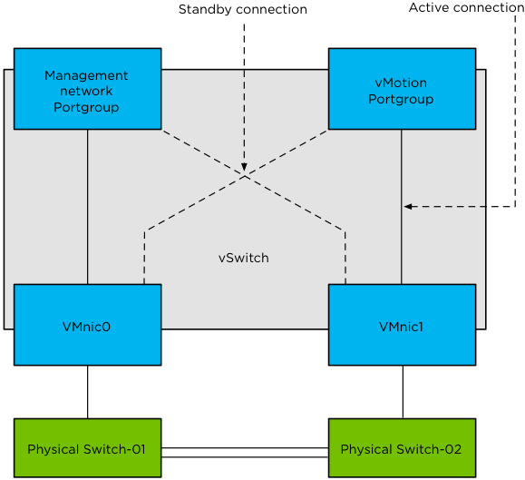
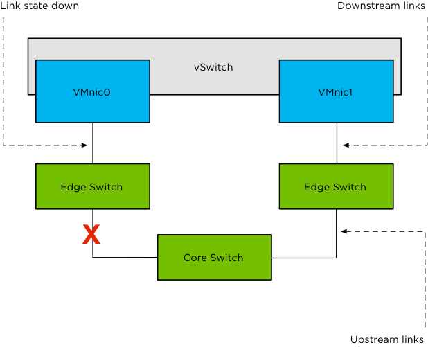

# Adding Resiliency to HA (Network Redundancy)

In the previous chapter we extensively covered both Isolation Detection, which triggers the selected Isolation Response and the impact of a false positive. The Isolation Response enables HA to restart virtual machines when “Power off” or “Shut down” has been selected and the host becomes isolated from the network. However, this also means that it is possible that, without proper redundancy, the Isolation Response may be unnecessarily triggered. This leads to downtime and should be prevented.

To increase resiliency for networking, VMware implemented the concept of NIC teaming in the hypervisor for both VMkernel and virtual machine networking. When discussing HA, this is especially important for the Management Network.

>*NIC teaming is the process of grouping together several physical NICs into one single logical NIC, which can be used for network fault tolerance and load balancing.*

Using this mechanism, it is possible to add redundancy to the Management Network to decrease the chances of an isolation event. This is, of course, also possible for other “Portgroups” but that is not the topic of this chapter or book. Another option is configuring an additional Management Network by enabling the “management network” tick box on another VMkernel port. A little understood fact is that if there are multiple VMkernel networks on the same subnet, HA will use all of them for management traffic, even if only one is specified for management traffic!

Although there are many configurations possible and supported, we recommend a simple but highly resilient configuration. We have included the vMotion (VMkernel) network in our example as combining the Management Network and the vMotion network on a single vSwitch is the most commonly used configuration and an industry accepted best practice.

Requirements:

* 2 physical NICs
* VLAN trunking

Recommended:

* 2 physical switches
* If available, enable “link state tracking” to ensure link failures are reported

The vSwitch should be configured as follows:

* vSwitch0: 2 Physical NICs (vmnic0 and vmnic1).
* 2 Portgroups (Management Network and vMotion VMkernel).
* Management Network active on vmnic0 and standby on vmnic1.
* vMotion VMkernel active on vmnic1 and standby on vmnic0.
* Failback set to No.

Each portgroup has a VLAN ID assigned and runs dedicated on its own physical NIC; only in the case of a failure it is switched over to the standby NIC. We highly recommend setting failback to “No” to avoid chances of an unwanted isolation event, which can occur when a physical switch routes no traffic during boot but the ports are reported as “up”. (NIC Teaming Tab)

Pros: Only 2 NICs in total are needed for the Management Network and vMotion VMkernel, especially useful in blade server environments. Easy to configure.

Cons: Just a single active path for heartbeats.

The following diagram depicts this active/standby scenario:



To increase resiliency, we also recommend implementing the following advanced settings and using NIC ports on different PCI busses – preferably NICs of a different make and model. When using a different make and model, even a driver failure could be mitigated.

Advanced Settings: ```das.isolationaddressX = <ip-address>```

The isolation address setting is discussed in more detail in chapter 4\. In short; it is the IP address that the HA agent pings to identify if the host is completely isolated from the network or just not receiving any heartbeats. If multiple VMkernel networks on different subnets are used, it is recommended to set an isolation address per network to ensure that each of these will be able to validate isolation of the host.

>**Basic design principle:** Take advantage of some of the basic features vSphere has to offer like NIC teaming. Combining different physical NICs will increase overall resiliency of your solution.

## Corner Case Scenario: Split-Brain

A split brain scenario is a scenario where a single virtual machine is powered up multiple times, typically on two different hosts. This is possible in the scenario where the isolation response is set to “leave powered on” and network based storage, like NFS / iSCSI and even Virtual SAN, is used. This situation can occur during a full network isolation, which may result in the lock on the virtual machine’s VMDK being lost, enabling HA to actually power up the virtual machine. As the virtual machine was not powered off on its original host (isolation response set to “leave powered on”), it will exist in memory on the isolated host and in memory with a disk lock on the host that was requested to restart the virtual machine.

Keep in mind that this truly is a corner case scenario which is very unlikely to occur in most environments. In case it does happen, HA relies on the “lost lock detection” mechanism to mitigate this scenario. In short ESXi detects that the lock on the VMDK has been lost and, when the datastore becomes accessible again and the lock cannot be reacquired, issues a question whether the virtual machine should be powered off; HA automatically answers the question with Yes. However, you will only see this question if you directly connect to the ESXi host during the failure. HA will generate an event for this auto-answered question though.

As stated above the question will be auto-answered and the virtual machine will be powered off to recover from the split brain scenario. The question still remains: in the case of an isolation with iSCSI or NFS, should you power off virtual machines or leave them powered on?

As just explained, HA will automatically power off your original virtual machine when it detects a split-brain scenario. This process however is not instantaneous and as such it is recommended to use the isolation response of “Power Off” or “Leave powered on. We also recommend increasing heartbeat network resiliency to avoid getting in to this situation. We will discuss the options you have for enhancing Management Network resiliency in the next chapter.

## Link State Tracking

This was already briefly mentioned in the list of recommendations, but this feature is something we would like to emphasize. We have noticed that people often forget about this even though many switches offer this capability, especially in blade server environments.

Link state tracking will mirror the state of an upstream link to a downstream link. Let’s clarify that with a diagram.



The diagram above depicts a scenario where an uplink of a “Core Switch” has failed. Without Link State Tracking, the connection from the “Edge Switch” to vmnic0 will be reported as up. With Link State Tracking enabled, the state of the link on the “Edge Switch” will reflect the state of the link of the “Core Switch” and as such be marked as “down”. You might wonder why this is important but think about it for a second. Many features that vSphere offer rely on networking and so do your virtual machines. In the case where the state is not reflected, some functionality might just fail, for instance network heartbeating could fail if it needs to flow through the core switch. We call this a ‘black hole’ scenario: the host sends traffic down a path that it believes is up, but the traffic never reaches its destination due to the failed upstream link.

>**Basic design principle:** Know your network environment, talk to the network administrators and ensure advanced features like Link State Tracking are used when possible to increase resiliency.

