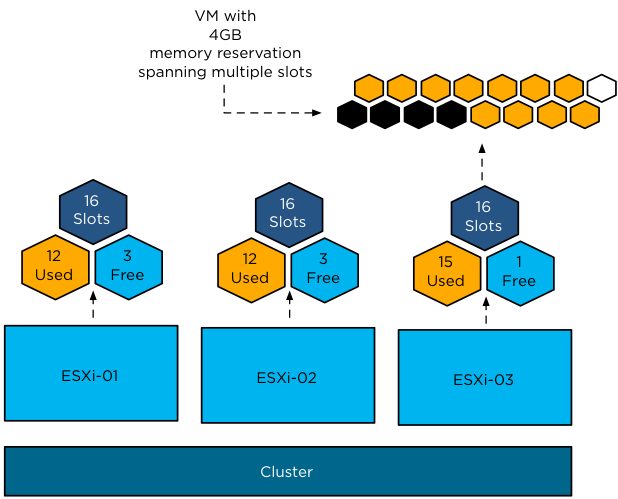

# Admission Control {#admission-control}

Admission Control is more than likely the most misunderstood concept vSphere holds today and because of this it is often disabled. However, Admission Control is a must when availability needs to be guaranteed and isn’t that the reason for enabling HA in the first place?

What is HA Admission Control about? Why does HA contain this concept called Admission Control? The “Availability Guide” a.k.a HA bible states the following:

>*vCenter Server uses admission control to ensure that sufficient resources are available in a cluster to provide failover protection and to ensure that virtual machine resource reservations are respected.*

Please read that quote again and especially the first two words. Indeed it is vCenter that is responsible for Admission Control, contrary to what many believe. Although this might seem like a trivial fact it is important to understand that this implies that Admission Control will not disallow HA initiated restarts. HA initiated restarts are done on a host level and not through vCenter.

As said, Admission Control guarantees that capacity is available for an HA initiated failover by reserving resources within a cluster. It calculates the capacity required for a failover based on available resources. In other words, if a host is placed into maintenance mode or disconnected, it is taken out of the equation. This also implies that if a host has failed or is not responding but has not been removed from the cluster, it is still included in the equation. “Available Resources” indicates that the virtualization overhead has already been subtracted from the total amount.

To give an example; VMkernel memory is subtracted from the total amount of memory to obtain the memory available memory for virtual machines. There is one gotcha with Admission Control that we want to bring to your attention before drilling into the different policies. When Admission Control is enabled, HA will in no way violate availability constraints. This means that it will always ensure multiple hosts are up and running and this applies for manual maintenance mode actions and, for instance, to VMware Distributed Power Management. So, if a host is stuck trying to enter Maintenance Mode, remember that it might be HA which is not allowing Maintenance Mode to proceed as it would violate the Admission Control Policy. In this situation, users can manually vMotion virtual machines off the host or temporarily disable admission control to allow the operation to proceed.

But what if you use something like Distributed Power Management (DPM), would that place all hosts in standby mode to reduce power consumption? No, DPM is smart enough to take hosts out of standby mode to ensure enough resources are available to provide for HA initiated failovers. If by any chance the resources are not available, HA will wait for these resources to be made available by DPM and then attempt the restart of the virtual machines. In other words, the retry count (5 retries by default) is not wasted in scenarios like these.

## Admission Control Policy

The Admission Control Policy dictates the mechanism that HA uses to guarantee enough resources are available for an HA initiated failover. This section gives a general overview of the available Admission Control Policies. The impact of each policy is described in the following section, including our recommendation. HA has three mechanisms to guarantee enough capacity is available to respect virtual machine resource reservations.


Below we have listed all three options currently available as the Admission Control Policy. Each option has a different mechanism to ensure resources are available for a failover and each option has its caveats.

## Admission Control Mechanisms {#admission-control-mechanisms}

Each Admission Control Policy has its own Admission Control mechanism. Understanding each of these Admission Control mechanisms is important to appreciate the impact each one has on your cluster design. For instance, setting a reservation on a specific virtual machine can have an impact on the achieved consolidation ratio. This section will take you on a journey through the trenches of Admission Control Policies and their respective mechanisms and algorithms.

### Host Failures Cluster Tolerates

The Admission Control Policy that has been around the longest is the “Host Failures Cluster Tolerates” policy. It is also historically the least understood Admission Control Policy due to its complex admission control mechanism.

This admission control policy can be configured in an N-1 fashion. This means that the number of host failures you can specify in a 32 host cluster is 31.

Within the vSphere Web Client it is possible to manually specify the slot size as can be seen in the below screenshot. The vSphere Web Client also allows you to view which virtual machines span multiple slots. This can be very useful in scenarios where the slot size has been explicitly specified, we will explain why in just a second.


The so-called “slots” mechanism is used when the “Host failures cluster tolerates” has been selected as the Admission Control Policy. The details of this mechanism have changed several times in the past and it is one of the most restrictive policies; more than likely, it is also the least understood.

Slots dictate how many virtual machines can be powered on before vCenter starts yelling “Out Of Resources!” Normally, a slot represents one virtual machine. Admission Control does not limit HA in restarting virtual machines, it ensures enough unfragmented resources are available to power on all virtual machines in the cluster by preventing “over-commitment”. Technically speaking “over-commitment” is not the correct terminology as Admission Control ensures virtual machine reservations can be satisfied and that all virtual machines’ initial memory overhead requirements are met. Although we have already touched on this, it doesn’t hurt repeating it as it is one of those myths that keeps coming back; **HA initiated failovers are not prone to the Admission Control Policy**. Admission Control is done by vCenter. HA initiated restarts, in a normal scenario, are executed directly on the ESXi host without the use of vCenter. The corner-case is where HA requests DRS (DRS is a vCenter task!) to defragment resources but that is beside the point. Even if resources are low and vCenter would complain, it couldn’t stop the restart from happening.

Let’s dig in to this concept we have just introduced, slots.

>*A slot is defined as a logical representation of the memory and CPU resources that satisfy the reservation requirements for any powered-on virtual machine in the cluster.*

In other words a slot is the worst case CPU and memory **reservation** scenario in a cluster. This directly leads to the first “gotcha.”

HA uses the highest CPU reservation of any given powered-on virtual machine and the highest memory reservation of any given powered-on virtual machine in the cluster. If no reservation of higher than 32 MHz is set, HA will use a default of 32 MHz for CPU. If no memory reservation is set, HA will use a default of 0 MB+memory overhead for memory. (See the VMware vSphere Resource Management Guide for more details on memory overhead per virtual machine configuration.) The following example will clarify what “worst-case” actually means.

**Example:** If virtual machine “VM1” has 2 GHz of CPU reserved and 1024 MB of memory reserved and virtual machine “VM2” has 1 GHz of CPU reserved and 2048 MB of memory reserved the slot size for memory will be 2048 MB (+ its memory overhead) and the slot size for CPU will be 2 GHz. It is a combination of the highest reservation of both virtual machines that leads to the total slot size. Reservations defined at the Resource Pool level however, will not affect HA slot size calculations.

>**Basic design principle:** Be really careful with reservations, if there’s no need to have them on a per virtual machine basis; don’t configure them, especially when using host failures cluster tolerates. If reservations are needed, resort to resource pool based reservations.

Now that we know the worst-case scenario is always taken into account when it comes to slot size calculations, we will describe what dictates the amount of available slots per cluster as that ultimately dictates how many virtual machines can be powered on in your cluster.

First, we will need to know the slot size for memory and CPU, next we will divide the total available CPU resources of a host by the CPU slot size and the total available memory resources of a host by the memory slot size. This leaves us with a total number of slots for both memory and CPU for a host. The most restrictive number (worst-case scenario) is the number of slots for this host. In other words, when you have 25 CPU slots but only 5 memory slots, the amount of available slots for this host will be 5 as HA always takes the worst case scenario into account to “guarantee” all virtual machines can be powered on in case of a failure or isolation.

The question we receive a lot is how do I know what my slot size is? The details around slot sizes can be monitored on the HA section of the Cluster’s Monitor tab by checking the the “Advanced Runtime Info” section when the “Host Failures” Admission Control Policy is configured.


Advanced Runtime Info will show the specifics the slot size and more useful details such as the number of slots available as depicted in Figure 30\.


As you can imagine, using reservations on a per virtual machine basis can lead to very conservative consolidation ratios. However, this is something that is configurable through the Web Client. If you have just one virtual machine with a really high reservation, you can set an explicit slot size by going to “Edit Cluster Services” and specifying them under the Admission Control Policy section as shown in Figure 29\.

If one of these advanced settings is used, HA will ensure that the virtual machine that skewed the numbers can be restarted by “assigning” multiple slots to it. However, when you are low on resources, this could mean that you are not able to power on the virtual machine with this reservation because resources may be fragmented throughout the cluster instead of available on a single host. HA will notify DRS that a power-on attempt was unsuccessful and a request will be made to defragment the resources to accommodate the remaining virtual machines that need to be powered on. In order for this to be successful DRS will need to be enabled and configured to fully automated. When not configured to fully automated user action is required to execute DRS recommendations.

The following diagram depicts a scenario where a virtual machine spans multiple slots:



Notice that because the memory slot size has been manually set to 1024 MB, one of the virtual machines (grouped with dotted lines) spans multiple slots due to a 4 GB memory reservation. As you might have noticed, none of the hosts has enough resources available to satisfy the reservation of the virtual machine that needs to failover. Although in total there are enough resources available, they are fragmented and HA will not be able to power-on this particular virtual machine directly but will request DRS to defragment the resources to accommodate this virtual machine’s resource requirements.

Admission Control does not take fragmentation of slots into account when slot sizes are manually defined with advanced settings. It will take the number of slots this virtual machine will consume into account by subtracting them from the total number of available slots, but it will not verify the amount of available slots per host to ensure failover. As stated earlier, though, HA will request DRS to defragment the resources. This is by no means a guarantee of a successful power-on attempt.

>**Basic design principle:** Avoid using advanced settings to decrease the slot size as it could lead to more down time and adds an extra layer of complexity. If there is a large discrepancy in size and reservations we recommend using the percentage based admission control policy.

Within the vSphere Web Client there is functionality which enables you to identify virtual machines which span multiple slots, as shown in Figure 29\. We highly recommend monitoring this section on a regular basis to get a better understand of your environment and to identify those virtual machines that might be problematic to restart in case of a host failure.

### Unbalanced Configurations and Impact on Slot Calculation 

It is an industry best practice to create clusters with similar hardware configurations. However, many companies started out with a small VMware cluster when virtualization was first introduced. When the time has come to expand, chances are fairly large the same hardware configuration is no longer available. The question is will you add the newly bought hosts to the same cluster or create a new cluster?

From a DRS perspective, large clusters are preferred as it increases the load balancing opportunities. However there is a caveat for DRS as well, which is described in the DRS section of this book. For HA, there is a big caveat. When you think about it and understand the internal workings of HA, more specifically the slot algorithm, you probably already know what is coming up.

Let’s first define the term “unbalanced cluster.”

An unbalanced cluster would, for instance, be a cluster with 3 hosts of which one contains substantially more memory than the other hosts in the cluster.

Let’s try to clarify that with an example.

Example:
What would happen to the total number of slots in a cluster of the following specifications?

* Three host cluster
* Two hosts have 16 GB of available memory
* One host has 32 GB of available memory

The third host is a brand new host that has just been bought and as prices of memory dropped immensely the decision was made to buy 32 GB instead of 16 GB.

The cluster contains a virtual machine that has 1 vCPU and 4 GB of memory. A 1024 MB memory reservation has been defined on this virtual machine. As explained earlier, a reservation will dictate the slot size, which in this case leads to a memory slot size of 1024 MB + memory overhead. For the sake of simplicity, we will calculate with 1024 MB. The following diagram depicts this scenario:


When Admission Control is enabled and the number of host failures has been selected as the Admission Control Policy, the number of slots will be calculated per host and the cluster in total. This will result in:

| **Host** | **Number of slots** |
| --- | --- |
| **ESXi-01** | 16 Slots |
| **ESXi-02** | 16 Slots |
| **ESXi-03** | 32 Slots |

As Admission Control is enabled, **a worst-case scenario is taken into account**. When a single host failure has been specified, this means that the host with the largest number of slots will be taken out of the equation. In other words, for our cluster, this would result in:

```ESXi-01 + ESXi-02 = 32 slots available```

Although you have doubled the amount of memory in one of your hosts, you are still stuck with only 32 slots in total. As clearly demonstrated, there is absolutely no point in buying additional memory for a single host when your cluster is designed with Admission Control enabled and the number of host failures has been selected as the Admission Control Policy.

In our example, the memory slot size happened to be the most restrictive; however, the same principle applies when CPU slot size is most restrictive.

>**Basic design principle:** When using admission control, balance your clusters and be conservative with reservations as it leads to decreased consolidation ratios.

Now, what would happen in the scenario above when the number of allowed host failures is to 2? In this case ESXi-03 is taken out of the equation and one of any of the remaining hosts in the cluster is also taken out, resulting in 16 slots. This makes sense, doesn’t it?

Can you avoid large HA slot sizes due to reservations without resorting to advanced settings? That’s the question we get almost daily and the answer is the “Percentage of Cluster Resources Reserved” admission control mechanism.

### Percentage of Cluster Resources Reserved

The Percentage of Cluster Resources Reserved admission control policy is one of the most used admission control policies. The simple reason for this is that it is the least restrictive and most flexible. It is also very easy to configure as shown in the screenshot below.


The main advantage of the percentage based Admission Control Policy is that it avoids the commonly experienced slot size issue where values are skewed due to a large reservation. But if it doesn’t use the slot algorithm, what does it use?

When you specify a percentage, and let’s assume for now that the percentage for CPU and memory will be configured equally, that percentage of the total amount of available resources will stay reserved for HA purposes. First of all, HA will add up all available resources to see how much it has available (virtualization overhead will be subtracted) in total. Then, HA will calculate how much resources are currently reserved by adding up all reservations for memory and for CPU for all powered on virtual machines.

For those virtual machines that do not have a reservation, a default of 32 MHz will be used for CPU and a default of 0 MB+memory overhead will be used for Memory. (Amount of overhead per configuration type can be found in the “Understanding Memory Overhead” section of the Resource Management guide.)

In other words:

((total amount of available resources – total reserved virtual machine resources)/total amount of available resources) <= (percentage HA should reserve as spare capacity)

Total reserved virtual machine resources includes the default reservation of 32 MHz and the memory overhead of the virtual machine.

Let’s use a diagram to make it a bit clearer:


Total cluster resources are 24GHz (CPU) and 96GB (MEM). This would lead to the following calculations:

```((24 GHz - (2 GHz + 1 GHz + 32 MHz + 4 GHz)) / 24 GHz) = 69 % available```

```((96 GB - (1,1 GB + 114 MB + 626 MB + 3,2 GB)/96 GB= 85 % available```

As you can see, the amount of memory differs from the diagram. Even if a reservation has been set, the amount of memory overhead is added to the reservation. This example also demonstrates how keeping CPU and memory percentage equal could create an imbalance. Ideally, of course, the hosts are provisioned in such a way that there is no CPU/memory imbalance. Experience over the years has proven, unfortunately, that most environments run out of memory resources first and this might need to be factored in when calculating the correct value for the percentage. However, this trend might be changing as memory is getting cheaper every day.

In order to ensure virtual machines can always be restarted, Admission Control will constantly monitor if the policy has been violated or not. Please note that this Admission Control process is part of vCenter and not of the ESXi host! When one of the thresholds is reached, memory or CPU, Admission Control will disallow powering on any additional virtual machines as that could potentially impact availability. These thresholds can be monitored on the HA section of the Cluster’s summary tab.


If you have an unbalanced cluster (hosts with different sizes of CPU or memory resources), your percentage should be equal or preferably larger than the percentage of resources provided by the largest host. This way you ensure that all virtual machines residing on this host can be restarted in case of a host failure.

As earlier explained, this Admission Control Policy does not use slots. As such, resources might be fragmented throughout the cluster. Although DRS is notified to rebalance the cluster, if needed, to accommodate these virtual machines resource requirements, a guarantee cannot be given. We recommend selecting the highest restart priority for this virtual machine (of course, depending on the SLA) to ensure it will be able to boot.

The following example and diagram (Figure 37) will make it more obvious: You have 3 hosts, each with roughly 80% memory usage, and you have configured HA to reserve 20% of resources for both CPU and memory. A host fails and all virtual machines will need to failover. One of those virtual machines has a 4 GB memory reservation. As you can imagine, HA will not be able to initiate a power-on attempt, as there are not enough memory resources available to guarantee the reserved capacity. Instead an event will get generated indicating "not enough resources for failover" for this virtual machine.


>**Basic design principle:** Although HA will utilize DRS to try to accommodate for the resource requirements of this virtual machine a guarantee cannot be given. Do the math; verify that any single host has enough resources to power-on your largest virtual machine. Also take restart priority into account for this/these virtual machine(s).

### Failover Hosts

The third option one could choose is to select one or multiple designated Failover hosts. This is commonly referred to as a hot standby.


It is “what you see is what you get”. When you designate hosts as failover hosts, they will not participate in DRS and you will not be able to run virtual machines on these hosts! These hosts are literally reserved for failover situations. HA will attempt to use these hosts first to failover the virtual machines. If, for whatever reason, this is unsuccessful, it will attempt a failover on any of the other hosts. For example, when three hosts would fail, including the hosts designated as failover hosts, HA will still try to restart the impacted virtual machines on the host that is left. Although this host was not a designated failover host, HA will use it to limit downtime.


## Decision Making Time

As with any decision you make, there is an impact to your environment. This impact could be positive but also, for instance, unexpected. This especially goes for HA Admission Control. Selecting the right Admission Control Policy can lead to a quicker Return On Investment and a lower Total Cost of Ownership. In the previous section, we described all the algorithms and mechanisms that form Admission Control and in this section we will focus more on the design considerations around selecting the appropriate Admission Control Policy for your or your customer’s environment.

The first decision that will need to be made is whether Admission Control will be enabled. We generally recommend enabling Admission Control as it is the only way of guaranteeing your virtual machines will be allowed to restart after a failure. It is important, though, that the policy is carefully selected and fits your or your customer’s requirements.

    Basic design principle
    Admission control guarantees enough capacity is available for virtual machine failover. As such we recommend enabling it.

Although we already have explained all the mechanisms that are being used by each of the policies in the previous section, we will give a high level overview and list all the pros and cons in this section. On top of that, we will expand on what we feel is the most flexible Admission Control Policy and how it should be configured and calculated.

### Host Failures Cluster Tolerates

This option is historically speaking the most used for Admission Control. Most environments are designed with an N+1 redundancy and N+2 is also not uncommon. This Admission Control Policy uses “slots” to ensure enough capacity is reserved for failover, which is a fairly complex mechanism. Slots are based on VM-level reservations and if reservations are not used a default slot size for CPU of 32 MHz is defined and for memory the largest memory overhead of any given virtual machine is used.

**Pros:**
* Fully automated (When a host is added to a cluster, HA re-calculates how many slots are available.)
* Guarantees failover by calculating slot sizes.

**Cons:**
* Can be very conservative and inflexible when reservations are used as the largest reservation dictates slot sizes.
* Unbalanced clusters lead to wastage of resources.
* Complexity for administrator from calculation perspective.
 
### Percentage as Cluster Resources Reserved 

The percentage based Admission Control is based on per-reservation calculation instead of the slots mechanism. The percentage based Admission Control Policy is less conservative than “Host Failures” and more flexible than “Failover Hosts”.

**Pros:**
* Accurate as it considers actual reservation per virtual machine to calculate available failover resources.
* Cluster dynamically adjusts when resources are added.

**Cons:**

* Manual calculations needed when adding additional hosts in a cluster and number of host failures needs to remain unchanged.
* Unbalanced clusters can be a problem when chosen percentage is too low and resources are fragmented, which means failover of a virtual machine can’t be guaranteed as the reservation of this virtual machine might not be available as a block of resources on a single host.

Please note that, although a failover cannot be guaranteed, there are few scenarios where a virtual machine will not be able to restart due to the integration HA offers with DRS and the fact that most clusters have spare capacity available to account for virtual machine demand variance. Although this is a corner-case scenario, it needs to be considered in environments where absolute guarantees must be provided.

### Specify Failover Hosts

With the “Specify Failover Hosts” Admission Control Policy, when one or multiple hosts fail, HA will attempt to restart all virtual machines on the designated failover hosts. The designated failover hosts are essentially “hot standby” hosts. In other words, DRS will not migrate virtual machines to these hosts when resources are scarce or the cluster is imbalanced.

**Pros:**
* What you see is what you get.
* No fragmented resources.

**Cons:**
* What you see is what you get.
* Dedicated failover hosts not utilized during normal operations.

## Recommendations

We have been asked many times for our recommendation on Admission Control and it is difficult to answer as each policy has its pros and cons. However, we generally recommend a Percentage based Admission Control Policy. It is the most flexible policy as it uses the actual reservation per virtual machine instead of taking a “worst case” scenario approach like the number of host failures does. However, the number of host failures policy guarantees the failover level under all circumstances. Percentage based is less restrictive, but offers lower guarantees that in all scenarios HA will be able to restart all virtual machines. With the added level of integration between HA and DRS we believe a Percentage based Admission Control Policy will fit most environments.

>**Basic design principle**: Do the math, and take customer requirements into account. We recommend using a “percentage” based admission control policy, as it is the most flexible.

Now that we have recommended which Admission Control Policy to use, the next step is to provide guidance around selecting the correct percentage. We cannot tell you what the ideal percentage is as that totally depends on the size of your cluster and, of course, on your resiliency model (N+1 vs. N+2). We can, however, provide guidelines around calculating how much of your resources should be set aside and how to prevent wasting resources.

## Selecting the Right Percentage

It is a common strategy to select a single host as a percentage of resources reserved for failover. We geneårally recommend selecting a percentage which is the equivalent of a single or multiple hosts, Let’s explain why and what the impact is of not using the equivalent of a single or multiple hosts.

Let’s start with an example: a cluster exists of 8 ESXi hosts, each containing 70 GB of available RAM. This might sound like an awkward memory configuration but to simplify things we have already subtracted 2 GB as virtualization overhead. Although virtualization overhead is probably less than 2 GB, we have used this number to make calculations easier. This example zooms in on memory but this concept also applies to CPU, of course.

For this cluster we will define the percentage of resources to reserve for both Memory and CPU to 20%. For memory, this leads to a total cluster memory capacity of 448 GB:

```(70 GB + 70 GB + 70 GB + 70 GB + 70 GB + 70 GB + 70 GB + 70 GB) * (1 – 20%)```

A total of 112 GB of memory is reserved as failover capacity.

Once a percentage is specified, that percentage of resources will be unavailable for virtual machines, therefore it makes sense to set the percentage as close to the value that equals the resources a single (or multiple) host represents. We will demonstrate why this is important in subsequent examples.

In the example above, 20% was used to be reserved for resources in an 8-host cluster. This configuration reserves more resources than a single host contributes to the cluster. HA’s main objective is to provide automatic recovery for virtual machines after a physical server failure. For this reason, it is recommended to reserve resources equal to a single or multiple hosts. When using the per-host level granularity in an 8-host cluster (homogeneous configured hosts), the resource contribution per host to the cluster is 12.5%. However, the percentage used must be an integer (whole number). It is recommended to round up to the value guaranteeing that the full capacity of one host is protected, in this example (Figure 40), the conservative approach would lead to a percentage of 13%.


### Aggressive Approach

We have seen many environments where the percentage was set to a value that was less than the contribution of a single host to the cluster. Although this approach reduces the amount of resources reserved for accommodating host failures and results in higher consolidation ratios, it also offers a lower guarantee that HA will be able to restart all virtual machines after a failure. One might argue that this approach will more than likely work as most environments will not be fully utilized; however it also does eliminate the guarantee that after a failure all virtual machines will be recovered. Wasn’t that the reason for enabling HA in the first place?

### Adding Hosts to Your Cluster

Although the percentage is dynamic and calculates capacity at a cluster-level, changes to your selected percentage might be required when expanding the cluster. The reason being that the amount of reserved resources for a fail-over might not correspond with the contribution per host and as a result lead to resource wastage. For example, adding 4 hosts to an 8-host cluster and continuing to use the previously configured admission control policy value of 13% will result in a failover capacity that is equivalent to 1.5 hosts. Figure 41 depicts a scenario where an 8-host cluster is expanded to 12 hosts. Each host holds 8 2 GHz cores and 70 GB of memory. The cluster was originally configured with admission control set to 13%, which equals to 109.2 GB and 24.96 GHz. If the requirement is to allow a single host failure 7.68 Ghz and 33.6 GB is “wasted” as clearly demonstrated in the diagram below.


### How to Define Your Percentage?

As explained earlier it will fully depend on the N+X model that has been chosen. Based on this model, we recommend selecting a percentage that equals the amount of resources a single host represents. So, in the case of an 8 host cluster and N+2 resiliency, the percentage should be set as follows: ```2 / 8 (*100) = 25%```

>**Basic design principle**: In order to avoid wasting resources we recommend carefully selecting your N+X resiliency architecture. Calculate the required percentage based on this architecture.
