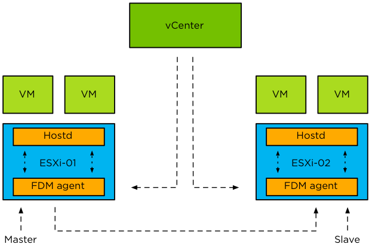
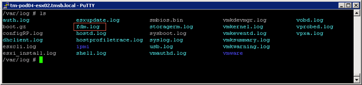
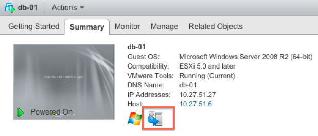

# Components of High Availability

Now that we know what the pre-requisites are and how to configure HA the next steps will be describing which components form HA. Keep in mind that this is still a “high level” overview. There is more under the cover that we will explain in following chapters. The following diagram depicts a two-host cluster and shows the key HA components.

As you can clearly see, there are three major components that form the foundation for HA as of vSphere 6.0:

* FDM
* HOSTD
* vCenter

The first and probably the most important component that forms HA is FDM (Fault Domain Manager). This is the HA agent.

The FDM Agent is responsible for many tasks such as communicating host resource information, virtual machine states and HA properties to other hosts in the cluster. FDM also handles heartbeat mechanisms, virtual machine placement, virtual machine restarts, logging and much more. We are not going to discuss all of this in-depth separately as we feel that this will complicate things too much.

BLAH

FDM, in our opinion, is one of the most important agents on an ESXi host, when HA is enabled, of course, and we are assuming this is the case. The engineers recognized this importance and added an extra level of resiliency to HA. FDM uses a single-process agent. However, FDM spawns a watchdog process. In the unlikely event of an agent failure, the watchdog functionality will pick up on this and restart the agent to ensure HA functionality remains without anyone ever noticing it failed. The agent is also resilient to network interruptions and “all paths down” (APD) conditions. Inter-host communication automatically uses another communication path (if the host is configured with redundant management networks) in the case of a network failure.

HA has no dependency on DNS as it works with IP addresses only. This is one of the major improvements that FDM brought. This does not mean that ESXi hosts need to be registered with their IP addresses in vCenter; it is still a best practice to register ESXi hosts by its fully qualified domain name

(FQDN) in vCenter. Although HA does not depend on DNS, remember that other services may depend on it. On top of that, monitoring and troubleshooting will be much easier when hosts are correctly registered within vCenter and have a valid FQDN.

> **Basic design principle**: Although HA is not dependent on DNS, it is still recommended to register the hosts with their FQDN for ease of operations/management.

vSphere HA also has a standardized logging mechanism, where a single log file has been created for all operational log messages; it is called fdm.log. This log file is stored under /var/log/ as depicted in Figure 5.

> **Basic design principle**: Ensure syslog is correctly configured and log files are offloaded to a safe location to offer the possibility of performing a root cause analysis in case disaster strikes.

## HOSTD Agent {#hostd-agent}

One of the most crucial agents on a host is HOSTD. This agent is responsible for many of the tasks we take for granted like powering on virtual machines. FDM talks directly to HOSTD and vCenter, so it is not dependent on VPXA, like in previous releases. This is, of course, to avoid any unnecessary overhead and dependencies, making HA more reliable than ever before and enabling HA to respond faster to power-on requests. That ultimately results in higher VM uptime.

When, for whatever reason, HOSTD is unavailable or not yet running after a restart, the host will not participate in any FDM-related processes. FDM relies on HOSTD for information about the virtual machines that are registered to the host, and manages the virtual machines using HOSTD APIs. In short, FDM is dependent on HOSTD and if HOSTD is not operational, FDM halts all functions and waits for HOSTD to become operational.

## vCenter {#vcenter}

That brings us to our final component, the vCenter Server. vCenter is the core of every vSphere Cluster and is responsible for many tasks these days. For our purposes, the following are the most important and the ones we will discuss in more detail:

* Deploying and configuring HA Agents
* Communication of cluster configuration changes
* Protection of virtual machines

vCenter is responsible for pushing out the FDM agent to the ESXi hosts when applicable. The push of these agents is done in parallel to allow for faster deployment and configuration of multiple hosts in a cluster. vCenter is also responsible for communicating configuration changes in the cluster to the host which is elected as the master. We will discuss this concept of master and slaves in the following chapter. Examples of configuration changes are modification or addition of an advanced setting or the introduction of a new host into the cluster.

HA leverages vCenter to retrieve information about the status of virtual machines and, of course, vCenter is used to display the protection status (Figure 6) of virtual machines. (What “virtual machine protection” actually means will be discussed in chapter 3.) On top of that, vCenter is responsible for the protection and unprotection of virtual machines. This not only applies to user initiated power-offs or power-ons of virtual machines, but also in the case where an ESXi host is disconnected from vCenter at which point vCenter will request the master HA agent to unprotect the affected virtual machines.

Although HA is configured by vCenter and exchanges virtual machine state information with HA, vCenter is not involved when HA responds to failure. It is comforting to know that in case of a host failure containing the virtualized vCenter Server, HA takes care of the failure and restarts the vCenter Server on another host, including all other configured virtual machines from that failed host.

There is a corner case scenario with regards to vCenter failure: if the ESXi hosts are so called “stateless hosts” and Distributed vSwitches are used for the management network, virtual machine restarts will not be attempted until vCenter is restarted. For stateless environments, vCenter and Auto Deploy availability is key as the ESXi hosts literally depend on them.

If vCenter is unavailable, it will not be possible to make changes to the configuration of the cluster. vCenter is the source of truth for the set of virtual machines that are protected, the cluster configuration, the virtual machine-to-host compatibility information, and the host membership. So, while HA, by design, will respond to failures without vCenter, HA relies on vCenter to be available to configure or monitor the cluster.

When a virtual vCenter Server, or the vCenter Server Appliance, has been implemented, we recommend setting the correct HA restart priorities for it. Although vCenter Server is not required to restart virtual machines, there are multiple components that rely on vCenter and, as such, a speedy recovery is desired. When configuring your vCenter virtual machine with a high priority for restarts, remember to include all services on which your vCenter server depends for a successful restart: DNS, MS AD and MS SQL (or any other database server you are using).

> **Basic design principles:**
1. In stateless environments, ensure vCenter and Auto Deploy are highly available as recovery time of your virtual machines might be dependent on them.
2. Understand the impact of virtualizing vCenter. Ensure it has high priority for restarts and ensure that services which vCenter Server depends on are available: DNS, AD and database.
