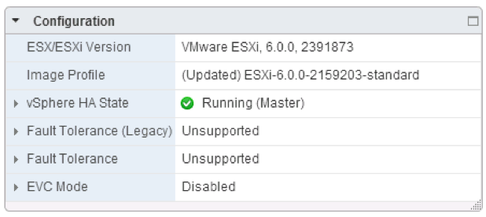
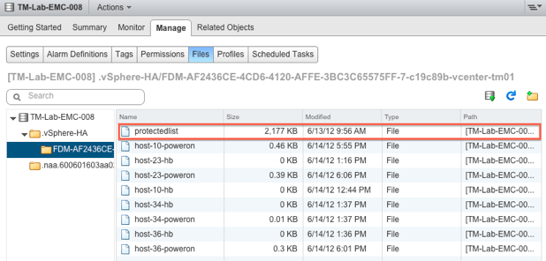
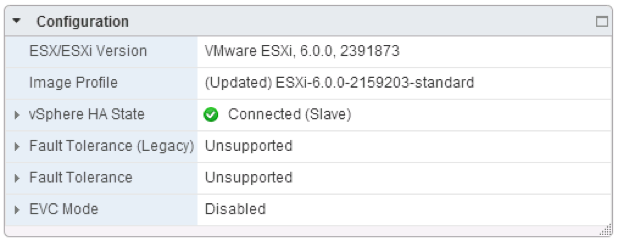
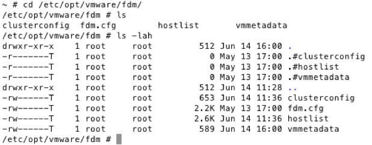
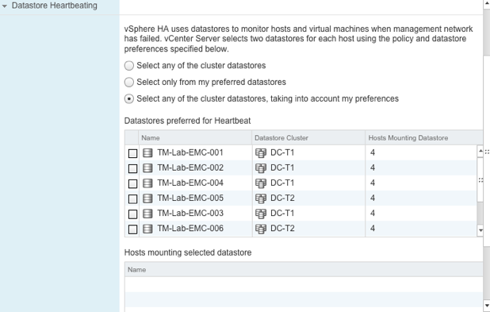
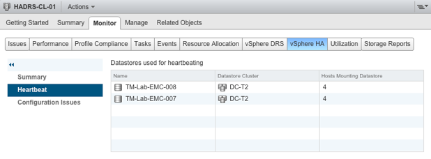
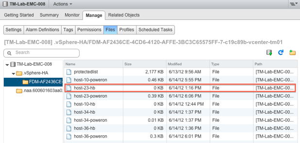
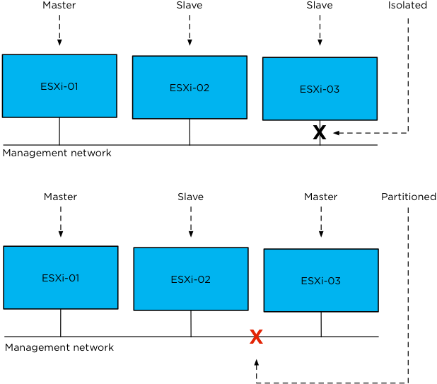
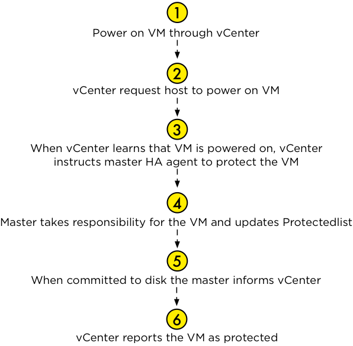
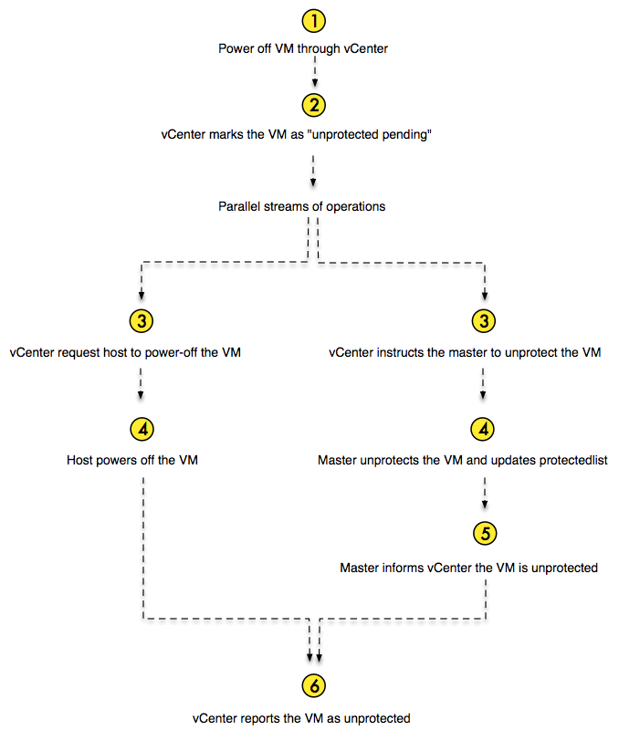

# Fundamental Concepts

Now that you know about the components of HA, it is time to start talking about some of the fundamental concepts of HA clusters:

* Master / Slave agents
* Heartbeating
* Isolated vs Network partitioned
* Virtual Machine Protection
* Component Protection

Everyone who has implemented vSphere knows that multiple hosts can be configured into a cluster. A cluster can best be seen as a collection of resources. These resources can be carved up with the use of vSphere Distributed Resource Scheduler (DRS) into separate pools of resources or used to increase availability by enabling HA.

The HA architecture introduces the concept of master and slave HA agents. Except during network partitions, which are discussed later, there is only one master HA agent in a cluster. Any agent can serve as a master, and all others are considered its slaves. A master agent is in charge of monitoring the health of virtual machines for which it is responsible and restarting any that fail. The slaves are responsible for forwarding information to the master agent and restarting any virtual machines at the direction of the master. The HA agent, regardless of its role as master or slave, also implements the VM/App monitoring feature which allows it to restart virtual machines in the case of an Operating System or restart services in the case of an application failure.

## Master Agent

As stated, one of the primary tasks of the master is to keep track of the state of the virtual machines it is responsible for and to take action when appropriate. In a normal situation there is only a single master in a cluster. We will discuss the scenario where multiple masters can exist in a single cluster in one of the following sections, but for now let’s talk about a cluster with a single master. A master will claim responsibility for a virtual machine by taking “ownership” of the datastore on which the virtual machine’s configuration file is stored.

> **Basic design principle: **
To maximize the chance of restarting virtual machines after a failure we recommend masking datastores on a cluster basis. Although sharing of datastores across clusters will work, it will increase complexity from an administrative perspective.

That is not all, of course. The HA master is also responsible for exchanging state information with vCenter. This means that it will not only receive but also send information to vCenter when required. The HA master is also the host that initiates the restart of virtual machines when a host has failed. You may immediately want to ask what happens when the master is the one that fails, or, more generically, which of the hosts can become the master and when is it elected?

### Election

A master is elected by a set of HA agents whenever the agents are not in network contact with a master. A master election thus occurs when HA is first enabled on a cluster and when the host on which the master is running:

* fails,
* becomes network partitioned or isolated,
* is disconnected from vCenter Server,
* is put into maintenance or standby mode,
* or when HA is reconfigured on the host.

The HA master election takes approximately 15 seconds and is conducted using UDP. While HA won’t react to failures during the election, once a master is elected, failures detected before and during the election will be handled. The election process is simple but robust. The host that is participating in the election with the greatest number of connected datastores will be elected master. If two or more hosts have the same number of datastores connected, the one with the highest Managed Object Id will be chosen. This however is done lexically; meaning that 99 beats 100 as 9 is larger than 1\. For each host, the HA State of the host will be shown on the Summary tab. This includes the role as depicted in screenshot below where the host is a master host.

After a master is elected, each slave that has management network connectivity with it will setup a single secure, encrypted, TCP connection to the master. This secure connection is SSL-based. One thing to stress here though is that slaves do not communicate with each other after the master has been elected unless a re-election of the master needs to take place.



As stated earlier, when a master is elected it will try to acquire ownership of all of the datastores it can directly access or access by proxying requests to one of the slaves connected to it using the management network. For regular storage architectures it does this by locking a file called “protectedlist” that is stored on the datastores in an existing cluster. The master will also attempt to take ownership of any datastores it discovers along the way, and it will periodically retry any it could not take ownership of previously.

The naming format and location of this file is as follows:

```/<root of datastore>/.vSphere-HA/<cluster-specific-directory>/protectedlist```

For those wondering how “<cluster-specific-directory>” is constructed:

```<uuid of vCenter Server>-<number part of the MoID of the cluster>-<random 8 char string>-<name of the host running vCenter Server>```

The master uses this protectedlist file to store the inventory. It keeps track of which virtual machines are protected by HA. Calling it an inventory might be slightly overstating: it is a list of protected virtual machines and it includes information around virtual machine CPU reservation and memory overhead. The master distributes this inventory across all datastores in use by the virtual machines in the cluster. The next screenshot shows an example of this file on one of the datastores.



Now that we know the master locks a file on the datastore and that this file stores inventory details, what happens when the master is isolated or fails? If the master fails, the answer is simple: the lock will expire and the new master will relock the file if the datastore is accessible to it.

In the case of isolation, this scenario is slightly different, although the result is similar. The master will release the lock it has on the file on the datastore to ensure that when a new master is elected it can determine the set of virtual machines that are protected by HA by reading the file. If, by any chance, a master should fail right at the moment that it became isolated, the restart of the virtual machines will be delayed until a new master has been elected. In a scenario like this, accuracy and the fact that virtual machines are restarted is more important than a short delay.

Let’s assume for a second that your master has just failed. What will happen and how do the slaves know that the master has failed? HA uses a point-to-point network heartbeat mechanism. If the slaves have received no network heartbeats from the master, the slaves will try to elect a new master. This new master will read the required information and will initiate the restart of the virtual machines within roughly 10 seconds. 

Restarting virtual machines is not the only responsibility of the master. It is also responsible for monitoring the state of the slave hosts and reporting this state to vCenter Server. If a slave fails or becomes isolated from the management network, the master will determine which virtual machines must be restarted. When virtual machines need to be restarted, the master is also responsible for determining the placement of those virtual machines. It uses a placement engine that will try to distribute the virtual machines to be restarted evenly across all available hosts.

All of these responsibilities are really important, but without a mechanism to detect a slave has failed, the master would be useless. Just like the slaves receive heartbeats from the master, the master receives heartbeats from the slaves so it knows they are alive.

## Slaves

A slave has substantially fewer responsibilities than a master: a slave monitors the state of the virtual machines it is running and informs the master about any changes to this state.

The slave also monitors the health of the master by monitoring heartbeats. If the master becomes unavailable, the slaves initiate and participate in the election process. Last but not least, the slaves send heartbeats to the master so that the master can detect outages. Like the master to slave communication, all slave to master communication is point to point. HA does not use multicast.



## Files for both Slave and Master {#files-for-both-slave-and-master}

Before explaining the details it is important to understand that both Virtual SAN and Virtual Volumes have introduced changes to the location and the usage of files. For specifics on these two different storage architectures we refer you to those respective sections in the book.

Both the master and slave use files not only to store state, but also as a communication mechanism. We’ve already seen the protectedlist file (Figure 8) used by the master to store the list of protected virtual machines. We will now discuss the files that are created by both the master and the slaves. Remote files are files stored on a shared datastore and local files are files that are stored in a location only directly accessible to that host.

### Remote Files {#remote-files}

The set of powered on virtual machines is stored in a per-host “poweron” file. It should be noted that, because a master also hosts virtual machines, it also creates a “poweron” file.

The naming scheme for this file is as follows:

host-number-poweron

Tracking virtual machine power-on state is not the only thing the “poweron” file is used for. This file is also used by the slaves to inform the master that it is isolated from the management network: the top line of the file will either contain a 0 or a 1\. A 0 (zero) means not-isolated and a 1 (one) means isolated. The master will inform vCenter about the isolation of the host.

### Local Files {#local-files}

As mentioned before, when HA is configured on a host, the host will store specific information about its cluster locally.



Each host, including the master, will store data locally. The data that is locally stored is important state information. Namely, the VM-to-host compatibility matrix, cluster configuration, and host membership list. This information is persisted locally on each host. Updates to this information is sent to the master by vCenter and propagated by the master to the slaves. Although we expect that most of you will never touch these files – and we highly recommend against modifying them – we do want to explain how they are used:

*   **clusterconfig** This file is not human-readable. It contains the configuration details of the cluster.
*   **vmmetadata** This file is not human-readable. It contains the actual compatibility info matrix for every HA protected virtual machine and lists all the hosts with which it is compatible plus a vm/host dictionary
*   **fdm.cfg** This file contains the configuration settings around logging. For instance, the level of logging and syslog details are stored in here.
*   **hostlist** A list of hosts participating in the cluster, including hostname, IP addresses, MAC addresses and heartbeat datastores.

## Heartbeating {#heartbeating}

We mentioned it a couple of times already in this chapter, and it is an important mechanism that deserves its own section: heartbeating. Heartbeating is the mechanism used by HA to validate whether a host is alive. HA has two different heartbeating mechanisms. These heartbeat mechanisms allows it to determine what has happened to a host when it is no longer responding. Let’s discuss traditional network heartbeating first.

### Network Heartbeating

Network Heartbeating is used by HA to determine if an ESXi host is alive. Each slave will send a heartbeat to its master and the master sends a heartbeat to each of the slaves, this is a point-to-point communication. These heartbeats are sent by default every second.

When a slave isn’t receiving any heartbeats from the master, it will try to determine whether it is Isolated– we will discuss “states” in more detail later on in this chapter.

>**Basic design principle:** Network heartbeating is key for determining the state of a host. Ensure the management network is highly resilient to enable proper state determination.

### Datastore Heartbeating

Datastore heartbeating adds an extra level of resiliency and prevents unnecessary restart attempts from occurring as it allows vSphere HA to determine whether a host is isolated from the network or is completely unavailable. How does this work?

Datastore heartbeating enables a master to more determine the state of a host that is not reachable via the management network. The new datastore heartbeat mechanism is used in case the master has lost network connectivity with the slaves. The datastore heartbeat mechanism is then used to validate whether a host has failed or is merely isolated/network partitioned. Isolation will be validated through the “poweron” file which, as mentioned earlier, will be updated by the host when it is isolated. Without the “poweron” file, there is no way for the master to validate isolation. Let that be clear! Based on the results of checks of both files, the master will determine the appropriate action to take. If the master determines that a host has failed (no datastore heartbeats), the master will restart the failed host’s virtual machines. If the master determines that the slave is Isolated or Partitioned, it will only take action when it is appropriate to take action. With that meaning that the master will only initiate restarts when virtual machines are down or powered down / shut down by a triggered isolation response, but we will discuss this in more detail in Chapter 4.

By default, HA selects 2 heartbeat datastores – it will select datastores that are available on all hosts, or as many as possible. Although it is possible to configure an advanced setting (_das.heartbeatDsPerHost_) to allow for more datastores for datastore heartbeating we do not recommend configuring this option as the default should be sufficient for most scenarios, except for stretched cluster environments where it is recommended to have two in each site manually selected.

The selection process gives preference to VMFS over NFS datastores, and seeks to choose datastores that are backed by different LUNs or NFS servers when possible. If desired, you can also select the heartbeat datastores yourself. We, however, recommend letting vCenter deal with this operational “burden” as vCenter uses a selection algorithm to select heartbeat datastores that are presented to all hosts. This however is not a guarantee that vCenter can select datastores which are connected to all hosts. It should be noted that vCenter is not site-aware. In scenarios where hosts are geographically dispersed it is recommend to manually select heartbeat datastores to ensure each site has one site-local heartbeat datastore at minimum. 

>**Basic design principle:** In a metro-cluster / geographically dispersed cluster we recommend setting the minimum number of heartbeat datastores to four. It is recommended to manually select site local datastores, two for each site.



The question now arises: what, exactly, is this datastore heartbeating and which datastore is used for this heartbeating? Let’s answer which datastore is used for datastore heartbeating first as we can simply show that with a screenshot, see below. vSphere displays extensive details around the “Cluster Status” on the Cluster’s Monitor tab. This for instance shows you which datastores are being used for heartbeating and which hosts are using which specific datastore(s). In addition, it displays how many virtual machines are protected and how many hosts are connected to the master.

 

In block based storage environments HA leverages an existing VMFS file system mechanism. The datastore heartbeat mechanism uses a so called “heartbeat region” which is updated as long as the file is open. On VMFS datastores, HA will simply check whether the heartbeat region has been updated. In order to update a datastore heartbeat region, a host needs to have at least one open file on the volume. HA ensures there is at least one file open on this volume by creating a file specifically for datastore heartbeating. In other words, a per-host file is created on the designated heartbeating datastores, as shown below. The naming scheme for this file is as follows:

```host-<number>-hb```

 

On NFS datastores, each host will write to its heartbeat file once every 5 seconds, ensuring that the master will be able to check host state. The master will simply validate this by checking that the time-stamp of the file changed.

Realize that in the case of a converged network environment, the effectiveness of datastore heartbeating will vary depending on the type of failure. For instance, a NIC failure could impact both network and datastore heartbeating. If, for whatever reason, the datastore or NFS share becomes unavailable or is removed from the cluster, HA will detect this and select a new datastore or NFS share to use for the heartbeating mechanism.

    Basic design principle
    Datastore heartbeating adds a new level of resiliency but is not the be-all end-all. In converged networking environments, the use of datastore heartbeating adds little value due to the fact that a NIC failure may result in both the network and storage becoming unavailable.

## Isolated versus Partitioned

We’ve already briefly touched on it and it is time to have a closer look. When it comes to network failures there are two different states that exist. What are these exactly and when is a host Partitioned rather than Isolated? Before we will explain this we want to point out that there is the state as reported by the master and the state as observed by an administrator and the characteristics these have.

First, consider the administrator’s perspective. Two hosts are considered partitioned if they are operational but cannot reach each other over the management network. Further, a host is isolated if it does not observe any HA management traffic on the management network and it can’t ping the configured isolation addresses. It is possible for multiple hosts to be isolated at the same time. We call a set of hosts that are partitioned but can communicate with each other a “management network partition”. Network partitions involving more than two partitions are possible but not likely.

Now, consider the HA perspective. When any HA agent is not in network contact with a master, they will elect a new master. So, when a network partition exists, a master election will occur so that a host failure or network isolation within this partition will result in appropriate action on the impacted virtual machine(s). The screenshot below shows possible ways in which an Isolation or a Partition can occur.



If a cluster is partitioned in multiple segments, each partition will elect its own master, meaning that if you have 4 partitions your cluster will have 4 masters. When the network partition is corrected, any of the four masters will take over the role and be responsible for the cluster again. It should be noted that a master could claim responsibility for a virtual machine that lives in a different partition. If this occurs and the virtual machine happens to fail, the master will be notified through the datastore communication mechanism.

In the HA architecture, whether a host is partitioned is determined by the master reporting the condition. So, in the above example, the master on host ESXi-01 will report ESXi-03 and 04 partitioned while the master on host 04 will report 01 and 02 partitioned. When a partition occurs, vCenter reports the perspective of one master.

A master reports a host as partitioned or isolated when it can’t communicate with the host over the management network, it can observe the host’s datastore heartbeats via the heartbeat datastores. The master cannot alone differentiate between these two states – a host is reported as isolated only if the host informs the master via the datastores that is isolated.

This still leaves the question open how the master differentiates between a Failed, Partitioned, or Isolated host.

When the master stops receiving network heartbeats from a slave, it will check for host “liveness” for the next 15 seconds. Before the host is declared failed, the master will validate if it has actually failed or not by doing additional liveness checks. First, the master will validate if the host is still heartbeating to the datastore. Second, the master will ping the management IP address of the host. If both are negative, the host will be declared Failed. This doesn’t necessarily mean the host has PSOD’ed; it could be the network is unavailable, including the storage network, which would make this host Isolated from an administrator’s perspective but Failed from an HA perspective. As you can imagine, however, there are a various combinations possible. The following table depicts these combinations including the “state”.

| **State** | **NetworkHeartbeat** | **StorageHeartbeat** | **Host Live-nessPing** | **Isolation Criteria Met** |
| --- | --- | --- | --- | --- |
| **Running** | Yes | N/A | N/A | N/A |
| **Isolated** | No | Yes | No | Yes |
| **Partitioned** | No | Yes | No | No |
| **Failed** | No | No | No | N/A |
| **FDM Agent Down** | N/A | N/A | Yes | N/A |

HA will trigger an action based on the state of the host. When the host is marked as Failed, a restart of the virtual machines will be initiated. When the host is marked as Isolated, the master might initiate the restarts.

The one thing to keep in mind when it comes to isolation response is that a virtual machine will only be shut down or powered off when the isolated host knows there is a master out there that has taken ownership for the virtual machine or when the isolated host loses access to the home datastore of the virtual machine.

For example, if a host is isolated and runs two virtual machines, stored on separate datastores, the host will validate if it can access each of the home datastores of those virtual machines. If it can, the host will validate whether a master owns these datastores. If no master owns the datastores, the isolation response will not be triggered and restarts will not be initiated. If the host does not have access to the datastore, for instance, during an “All Paths Down” condition, HA will trigger the isolation response to ensure the “original” virtual machine is powered down and will be safely restarted. This to avoid so-called “split-brain” scenarios.

To reiterate, as this is a very important aspect of HA and how it handles network isolations, the remaining hosts in the cluster will only be requested to restart virtual machines when the master has detected that either the host has failed or has become isolated and the isolation response was triggered.

## Virtual Machine Protection

Virtual machine protection happens on several layers but is ultimately the responsibility of vCenter. We have explained this briefly but want to expand on it a bit more to make sure everyone understands the dependency on vCenter when it comes to protecting virtual machines. We do want to stress that this only applies to protecting virtual machines; virtual machine restarts in no way require vCenter to be available at the time.

When the state of a virtual machine changes, vCenter will direct the master to enable or disable HA protection for that virtual machine. Protection, however, is only guaranteed when the master has committed the change of state to disk. The reason for this, of course, is that a failure of the master would result in the loss of any state changes that exist only in memory. As pointed out earlier, this state is distributed across the datastores and stored in the “_protectedlist_” file.

When the power state change of a virtual machine has been committed to disk, the master will inform vCenter Server so that the change in status is visible both for the user in vCenter and for other processes like monitoring tools.

To clarify the process, we have created a workflow diagram of the protection of a virtual machine from the point it is powered on through vCenter:



But what about “unprotection?” When a virtual machine is powered off, it must be removed from the protectedlist. We have documented this workflow in the following diagram for the situation where the power off is invoked from vCenter.


