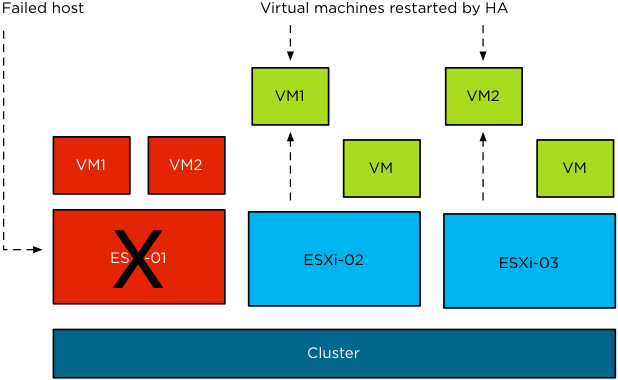
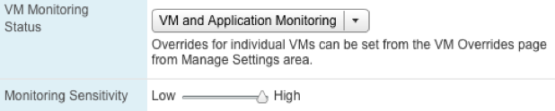
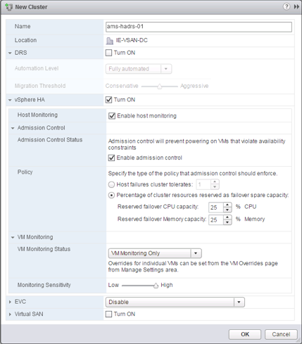

# Introduction to vSphere High Availability
Availability has traditionally been one of the most important aspects when providing services. When providing services on a shared platform like VMware vSphere, the impact of downtime exponentially grows as many services run on a single physical machine. As such VMware engineered a feature called VMware vSphere High Availability. VMware vSphere High Availability, hereafter simply referred to as HA, provides a simple and cost effective solution to increase availability for any application running in a virtual machine regardless of its operating system. It is configured using a couple of simple steps through vCenter Server (vCenter) and as such provides a uniform and simple interface. HA enables you to create a cluster out of multiple ESXi hosts. This will allow you to protect virtual machines and their workloads. In the event of a failure of one of the hosts in the cluster, impacted virtual machines are automatically restarted on other ESXi hosts within that same VMware vSphere Cluster (cluster). 

On top of that, in the case of a Guest OS level failure, HA can restart the failed Guest OS. This feature is called VM Monitoring, but is sometimes also referred to as VM-HA. This might sound fairly complex but again can be implemented with a single click.

Unlike many other clustering solutions, HA is a simple solution to implement and literally enabled within 5 clicks. On top of that, HA is widely adopted and used in all situations. However, HA is not a 1:1 replacement for solutions like Microsoft Clustering Services / Windows Server Failover Clustering (WSFC). The main difference between WSFC and HA being that WSFC was designed to protect stateful cluster-aware applications while HA was designed to protect any virtual machine regardless of the type of workload within, but also can be extended to the application layer through the use of VM and Application Monitoring.

In the case of HA, a fail-over incurs downtime as the virtual machine is literally restarted on one of the remaining hosts in the cluster. Whereas MSCS transitions the service to one of the remaining nodes in the cluster when a failure occurs. In contrary to what many believe, WSFC does not guarantee that there is no downtime during a transition. On top of that, your application needs to be cluster-aware and stateful in order to get the most out of this mechanism, which limits the number of workloads that could really benefit from this type of clustering. 

One might ask why would you want to use HA when a virtual machine is restarted and service is temporarily lost. The answer is simple; not all virtual machines (or services) need 99.999% uptime. For many services the type of availability HA provides is more than sufficient. On top of that, many applications were never designed to run on top of an WSFC cluster. This means that there is no guarantee of availability or data consistency if an application is clustered with WSFC but is not cluster-aware.

In addition, WSFC clustering can be complex and requires special skills and training. One example is managing patches and updates/upgrades in a WSFC environment; this could even lead to more downtime if not operated correctly and definitely complicates operational procedures. HA however reduces complexity, costs (associated with downtime and MSCS), resource overhead and unplanned downtime for minimal additional costs. It is important to note that HA, contrary to WSFC, does not require any changes to the guest as HA is provided on the hypervisor level. Also, VM Monitoring does not require any additional software or OS modifications except for VMware Tools, which should be installed anyway as a best practice. In case even higher availability is required, VMware also provides a level of application awareness through Application Monitoring, which has been leveraged by partners like Symantec to enable application level resiliency and could be used by in-house development teams to increase resiliency for their application.

HA has proven itself over and over again and is widely adopted within the industry; if you are not using it today, hopefully you will be convinced after reading this section of the book. 

## vSphere 6.0

Before we dive into the main constructs of HA and describe all the choices one has to make when configuring HA, we will first briefly touch on what’s new in vSphere 6.0 and describe the basic requirements and steps needed to enable HA. This book covers all the released versions of what is known within VMware as “Fault Domain Manager” (FDM) which was introduced with vSphere 5.0. We will call out the differences in behavior in the different versions where applicable, our baseline however is vSphere 6.0.

### What’s New in 6.0?

Compared to vSphere 5.0 the changes introduced with vSphere 6.0 for HA appear to be minor. However, some of the new functionality will make the life of many of you much easier. Although the list is relatively short, from an engineering point of view many of these things have been an enormous effort as they required change to the deep fundaments of the HA architecture.

* Support for Virtual Volumes – With Virtual Volumes a new type of storage entity is introduced in vSphere 6.0\. This has also resulted in some changes in the HA architecture to accommodate for this new way of storing virtual machines
* Support for Virtual SAN – This was actually introduced with vSphere 5.5, but as it is new too many of you and lead to changes in the architecture we decided to include it in this update
* VM Component Protection – This allows HA to respond to a scenario where the connection to the virtual machine’s datastore is impacted temporarily or permanently
    * HA “Response for Datastore with All Paths Down”
    * HA “Response for Datastore with Permanent Device Loss”
* Increased host scale – Cluster limit has grown from 32 to 64 hosts
* Increased VM scale – Cluster limit has grown from 4000 VMs to 8000 VMs per cluster
* Secure RPC – Secures the VM/App monitoring channel
* Full IPv6 support
* Registration of “HA Disabled” VMs on hosts after failure

## What is required for HA to Work?

Each feature or product has very specific requirements and HA is no different. Knowing the requirements of HA is part of the basics we have to cover before diving into some of the more complex concepts. For those who are completely new to HA, we will also show you how to configure it.

### Prerequisites {#prerequisites}

Before enabling HA it is highly recommend validating that the environment meets all the prerequisites. We have also included recommendations from an infrastructure perspective that will enhance resiliency.

Requirements:
* Minimum of two ESXi hosts
* Minimum of 5GB memory per host to install ESXi and enable HA
* VMware vCenter Server
* Shared Storage for virtual machines
* Pingable gateway or other reliable address

Recommendation:
* Redundant Management Network (not a requirement, but highly recommended)
* 8GB of memory or more per host
* Multiple shared datastores
 
### Firewall Requirements {#firewall-requirements}

The following table contains the ports that are used by HA for communication. If your environment contains firewalls external to the host, ensure these ports are opened for HA to function correctly. HA will open the required ports on the ESX or ESXi firewall.

| **Port** | **Protocol** | **Direction** |
| --- | --- | --- |
| **8182** | UDP | Inbound |
| **8182** | TCP | Inbound |
| **8182** | UDP | Outbound |
| **8182** | TCP | Outbound |

### Configuring vSphere High Availability {#configuring-vsphere-high-availability}

HA can be configured with the default settings within a couple of clicks. The following steps will show you how to create a cluster and enable HA, including VM Monitoring, using the vSphere Web Client. Each of the settings and the design decisions associated with these steps will be described in more depth in the following chapters.

1.  Click “Hosts & Clusters” under Inventories on the Home tab.
2.  Right-click the Datacenter in the Inventory tree and click New Cluster.
3.  Give the new cluster an appropriate name. We recommend at a minimum including the location of the cluster and a sequence number ie. ams-hadrs-001.
4.  Select Turn On vSphere HA.
5.  Ensure “Enable host monitoring” and “Enable admission control” is selected.
6.  Select “Percentage of cluster resources…” under Policy and specify a percentage.
7.  Enable VM Monitoring Status by selecting “VM and Application Monitoring”.
8.  Click “OK” to complete the creation of the cluster.

When the HA cluster has been created, the ESXi hosts can be added to the cluster simply by right clicking the host and selecting “Move To”, if they were already added to vCenter, or by right clicking the cluster and selecting “Add Host”.

When an ESXi host is added to the newly-created cluster, the HA agent will be loaded and configured. Once this has completed, HA will enable protection of the workloads running on this ESXi host.

As we have clearly demonstrated, HA is a simple clustering solution that will allow you to protect virtual machines against host failure and operating system failure in literally minutes. Understanding the architecture of HA will enable you to reach that extra 9 when it comes to availability. The following chapters will discuss the architecture and fundamental concepts of HA. We will also discuss all decision-making moments to ensure you will configure HA in such a way that it meets the requirements of your or your customer’s environment.
