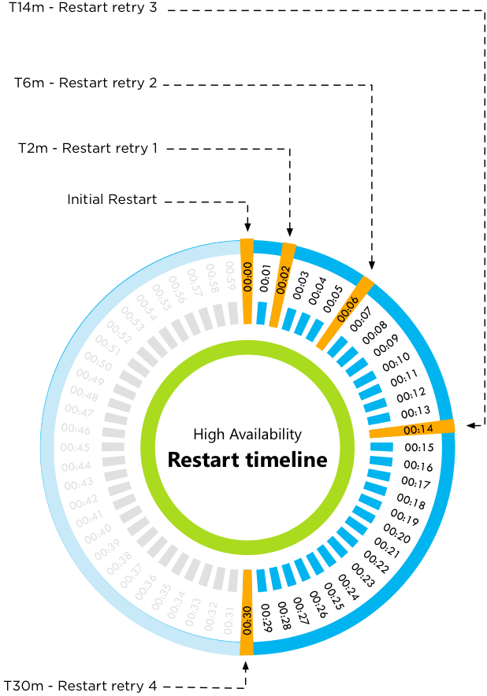
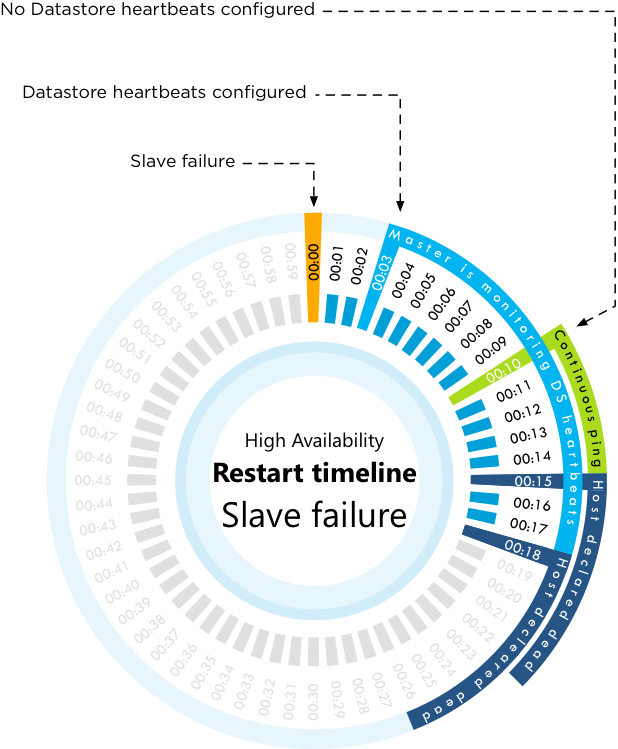
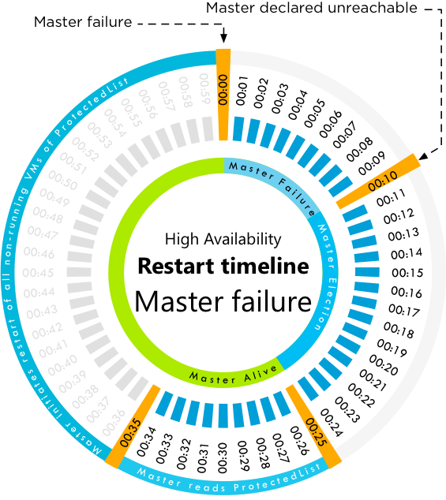
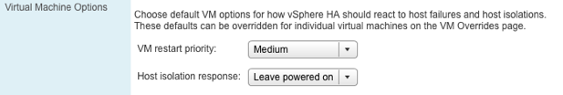
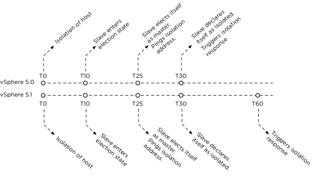
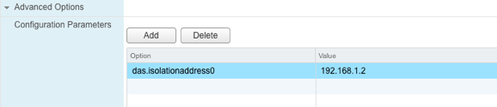
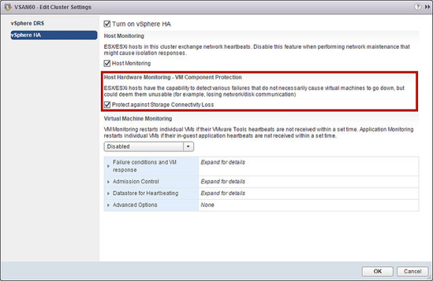
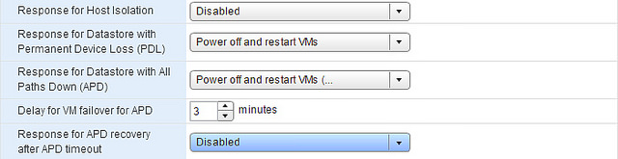

# Restarting Virtual Machines

In the previous chapter, we have described most of the lower level fundamental concepts of HA. We have shown you that multiple mechanisms increase resiliency and reliability of HA. Reliability of HA in this case mostly refers to restarting (or resetting) virtual machines, as that remains HA’s primary task.

HA will respond when the state of a host has changed, or, better said, when the state of one or more virtual machines has changed. There are multiple scenarios in which HA will respond to a virtual machine failure, the most common of which are listed below:

* Failed host
* Isolated host
* Failed guest operating system

Depending on the type of failure, but also depending on the role of the host, the process will differ slightly. Changing the process results in slightly different recovery timelines. There are many different scenarios and there is no point in covering all of them, so we will try to describe the most common scenario and include timelines where possible.

Before we dive into the different failure scenarios, we want to explain how restart priority and retries work.

## Restart Priority and Order

HA can take the configured priority of the virtual machine into account when restarting VMs. However, it is good to know that Agent VMs take precedence during the restart procedure as the “regular” virtual machines may rely on them. A good example of an agent virtual machine is a virtual storage appliance.

Prioritization is done by each host and not globally. Each host that has been requested to initiate restart attempts will attempt to restart all top priority virtual machines before attempting to start any other virtual machines. If the restart of a top priority virtual machine fails, it will be retried after a delay. In the meantime, however, HA will continue powering on the remaining virtual machines. Keep in mind that some virtual machines might be dependent on the agent virtual machines. You should document which virtual machines are dependent on which agent virtual machines and document the process to start up these services in the right order in the case the automatic restart of an agent virtual machine fails.

> **Basic design principle**: Virtual machines can be dependent on the availability of agent virtual machines or other virtual machines. Although HA will do its best to ensure all virtual machines are started in the correct order, this is not guaranteed. Document the proper recovery process.

Besides agent virtual machines, HA also prioritizes FT secondary machines. We have listed the full order in which virtual machines will be restarted below:

* Agent virtual machines
* FT secondary virtual machines
* Virtual Machines configured with a restart priority of high
* Virtual Machines configured with a medium restart priority
* Virtual Machines configured with a low restart priority

It should be noted that HA will not place any virtual machines on a host if the required number of agent virtual machines are not running on the host at the time placement is done.

Now that we have briefly touched on it, we would also like to address “restart retries” and parallelization of restarts as that more or less dictates how long it could take before all virtual machines of a failed or isolated host are restarted.

## Restart Retries 

The number of retries is configurable as of vCenter 2.5 U4 with the advanced option “_das.maxvmrestartcount_”. The default value is 5. Note that the initial restart is included.

HA will try to start the virtual machine on one of your hosts in the affected cluster; if this is unsuccessful on that host, the restart count will be increased by 1. Before we go into the exact timeline, let it be clear that T0 is the point at which the master initiates the first restart attempt. This by itself could be 30 seconds after the virtual machine has failed. The elapsed time between the failure of the virtual machine and the restart, though, will depend on the scenario of the failure, which we will discuss in this chapter.

As said, the default number of restarts is 5. There are specific times associated with each of these attempts. The following bullet list will clarify this concept. The ‘m’ stands for “minutes” in this list.

* T0 – Initial Restart
* T2m – Restart retry 1
* T6m – Restart retry 2
* T14m – Restart retry 3
* T30m – Restart retry 4



As clearly depicted in the diagram above, a successful power-on attempt could take up to ~30 minutes in the case where multiple power-on attempts are unsuccessful. This is, however, not exact science. For instance, there is a 2-minute waiting period between the initial restart and the first restart retry. HA will start the 2-minute wait as soon as it has detected that the initial attempt has failed. So, in reality, T2 could be T2 plus 8 seconds. Another important fact that we want emphasize is that there is no coordination between masters, and so if multiple ones are involved in trying to restart the virtual machine, each will retain their own sequence. Multiple masters could attempt to restart a virtual machine. Although only one will succeed, it might change some of the timelines.

What about VMs which are "disabled" for HA? What will happen with those VMs? Before vSphere 6.0 those VMs would be left alone, as of vSphere 6.0 these VMs will be registered on another host after a failure. This will allow you to easily power-on that VM when needed without needed to manually re-register it yourself. Note, HA will not do a power-on of the VM, it will just register it for you!

Let’s give an example to clarify the scenario in which a master fails during a restart sequence:

```Cluster: 4 Host (esxi01, esxi02, esxi03, esxi04)```<br>
```Master: esxi01```

The host “esxi02” is running a single virtual machine called “vm01” and it fails. The master, esxi01, will try to restart it but the attempt fails. It will try restarting “vm01” up to 5 times but, unfortunately, on the 4<sup>th</sup> try, the master also fails. An election occurs and “esxi03” becomes the new master. It will now initiate the restart of “vm01”, and if that restart would fail it will retry it up to 4 times again for a total including the initial restart of 5.

Be aware, though, that a successful restart might never occur if the restart count is reached and all five restart attempts (the default value) were unsuccessful.

When it comes to restarts, one thing that is very important to realize is that HA will not issue more than 32 concurrent power-on tasks on a given host. To make that more clear, let’s use the example of a two host cluster: if a host fails which contained 33 virtual machines and all of these had the same restart priority, 32 power on attempts would be initiated. The 33<sup>rd</sup> power on attempt will only be initiated when one of those 32 attempts has completed regardless of success or failure of one of those attempts.

Now, here comes the gotcha. If there are 32 low-priority virtual machines to be powered on and a single high-priority virtual machine, the power on attempt for the low-priority virtual machines will not be issued until the power on attempt for the high priority virtual machine has completed. Let it be absolutely clear that HA does not wait to restart the low-priority virtual machines until the high-priority virtual machines are started, it waits for the issued power on attempt to be reported as “completed”. In theory, this means that if the power on attempt fails, the low-priority virtual machines could be powered on before the high priority virtual machine.

The restart priority however does guarantee that when a placement is done, the higher priority virtual machines get first right to any available resources.

>**Basic design principle**: Configuring restart priority of a virtual machine is not a guarantee that virtual machines will actually be restarted in this order. Ensure proper operational procedures are in place for restarting services or virtual machines in the appropriate order in the event of a failure.    

Now that we know how virtual machine restart priority and restart retries are handled, it is time to look at the different scenarios.

* Failed host
  * Failure of a master
  * Failure of a slave
* Isolated host and response
 
## Failed Host

When discussing a failed host scenario it is needed to make a distinction between the failure of a master versus the failure of a slave. We want to emphasize this because the time it takes before a restart attempt is initiated differs between these two scenarios. Although the majority of you probably won’t notice the time difference, it is important to call out. Let’s start with the most common failure, that of a host failing, but note that failures generally occur infrequently. In most environments, hardware failures are very uncommon to begin with. Just in case it happens, it doesn’t hurt to understand the process and its associated timelines.

### The Failure of a Slave

The failure of a slave host is a fairly complex scenario. Part of this complexity comes from the introduction of a new heartbeat mechanism. Actually, there are two different scenarios: one where heartbeat datastores are configured and one where heartbeat datastores are not configured. Keeping in mind that this is an actual failure of the host, the timeline is as follows:

* T0 – Slave failure.
* T3s – Master begins monitoring datastore heartbeats for 15 seconds.
* T10s – The host is declared unreachable and the master will ping the management network of the failed host. This is a continuous ping for 5 seconds.
* T15s – If **no** heartbeat datastores are configured, the host will be declared dead.
* T18s – If heartbeat datastores are configured, the host will be declared dead.

The master monitors the network heartbeats of a slave. When the slave fails, these heartbeats will no longer be received by the master. We have defined this as T0\. After 3 seconds (T3s), the master will start monitoring for datastore heartbeats and it will do this for 15 seconds. On the 10<sup>th</sup> second (T10s), when no network or datastore heartbeats have been detected, the host will be declared as “unreachable”. The master will also start pinging the management network of the failed host at the 10<sup>th</sup> second and it will do so for 5 seconds. If no heartbeat datastores were configured, the host will be declared “dead” at the 15<sup>th</sup> second (T15s) and virtual machine restarts will be initiated by the master. If heartbeat datastores have been configured, the host will be declared dead at the 18<sup>th</sup> second (T18s) and restarts will be initiated. We realize that this can be confusing and hope the timeline depicted in the diagram below makes it easier to digest.



The master filters the virtual machines it thinks failed before initiating restarts. The master uses the protectedlist for this, on-disk state could be obtained only by one master at a time since it required opening the protectedlist file in exclusive mode. If there is a network partition multiple masters could try to restart the same virtual machine as vCenter Server also provided the necessary details for a restart. As an example, it could happen that a master has locked a virtual machine’s home datastore and has access to the protectedlist while the other master is in contact with vCenter Server and as such is aware of the current desired protected state. In this scenario it could happen that the master which does not own the home datastore of the virtual machine will restart the virtual machine based on the information provided by vCenter Server.

This change in behavior was introduced to avoid the scenario where a restart of a virtual machine would fail due to insufficient resources in the partition which was responsible for the virtual machine. With this change, there is less chance of such a situation occurring as the master in the other partition would be using the information provided by vCenter Server to initiate the restart.

That leaves us with the question of what happens in the case of the failure of a master.

### The Failure of a Master

In the case of a master failure, the process and the associated timeline are slightly different. The reason being that there needs to be a master before any restart can be initiated. This means that an election will need to take place amongst the slaves. The timeline is as follows:

* T0 – Master failure.
* T10s – Master election process initiated.
* T25s – New master elected and reads the protectedlist.
* T35s – New master initiates restarts for all virtual machines on the protectedlist which are not running.

Slaves receive network heartbeats from their master. If the master fails, let’s define this as T0 (T zero), the slaves detect this when the network heartbeats cease to be received. As every cluster needs a master, the slaves will initiate an election at T10s. The election process takes 15s to complete, which brings us to T25s. At T25s, the new master reads the protectedlist. This list contains all the virtual machines, which are protected by HA. At T35s, the master initiates the restart of all virtual machines that are protected but not currently running. The timeline depicted in the diagram below hopefully clarifies the process.



Besides the failure of a host, there is another reason for restarting virtual machines: an isolation event.

## Isolation Response and Detection {#isolation-response-and-detection}

Before we will discuss the timeline and the process around the restart of virtual machines after an isolation event, we will discuss Isolation Response and Isolation Detection. One of the first decisions that will need to be made when configuring HA is the “Isolation Response”.

### Isolation Response {#isolation-response}

The Isolation Response refers to the action that HA takes for its virtual machines when the host has lost its connection with the network and the remaining nodes in the cluster. This does not necessarily mean that the whole network is down; it could just be the management network ports of this specific host. Today there are three isolation responses: “Power off”, “Leave powered on” and “Shut down”. This isolation response answers the question, “what should a host do with the virtual machines it manages when it detects that it is isolated from the network?” Let’s discuss these three options more in-depth:

* Power off – When isolation occurs, all virtual machines are powered off. It is a hard stop, or to put it bluntly, the “virtual” power cable of the virtual machine will be pulled out!
* Shut down – When isolation occurs, all virtual machines running on the host will be shut down using a guest-initiated shutdown through VMware Tools. If this is not successful within 5 minutes, a “power off” will be executed. This time out value can be adjusted by setting the advanced option _das.isolationShutdownTimeout_. If VMware Tools is not installed, a “power off” will be initiated immediately.
* Leave powered on – When isolation occurs on the host, the state of the virtual machines remains unchanged.

This setting can be changed on the cluster settings under virtual machine options.



The default setting for the isolation response has changed multiple times over the last couple of years and this has caused some confusion.

* Up to ESXi3.5 U2 / vCenter 2.5 U2 the default isolation response was “Power off”
* With ESXi3.5 U3 / vCenter 2.5 U3 this was changed to “Leave powered on”
* With vSphere 4.0 it was changed to “Shut down”.
* With vSphere 5.0 it has been changed to “Leave powered on”.

Keep in mind that these changes are only applicable to newly created clusters. When creating a new cluster, it may be required to change the default isolation response based on the configuration of existing clusters and/or your customer’s requirements, constraints and expectations. When upgrading an existing cluster, it might be wise to apply the latest default values. You might wonder why the default has changed once again. There was a lot of feedback from customers that “Leave powered on” was the desired default value.

> **Basic design principle**: Before upgrading an environment to later versions, ensure you validate the best practices and default settings. Document them, including justification, to ensure all people involved understand your reasons.

The question remains, which setting should be used? The obvious answer applies here; it depends. We prefer “Leave powered on” because it eliminates the chances of having a false positive and its associated down time. One of the problems that people have experienced in the past is that HA triggered its isolation response when the full management network went down. Basically resulting in the power off (or shutdown) of every single virtual machine and none being restarted. This problem has been mitigated. HA will validate if virtual machines restarts can be attempted – there is no reason to incur any down time unless absolutely necessary. It does this by validating that a master owns the datastore the virtual machine is stored on. Of course, the isolated host can only validate this if it has access to the datastores. In a converged network environment with iSCSI storage, for instance, it would be impossible to validate this during a full isolation as the validation would fail due to the inaccessible datastore from the perspective of the isolated host.

We feel that changing the isolation response is most useful in environments where a failure of the management network is likely correlated with a failure of the virtual machine network(s). If the failure of the management network won’t likely correspond with the failure of the virtual machine networks, isolation response would cause unnecessary downtime as the virtual machines can continue to run without management network connectivity to the host.

A second use for power off/shutdown is in scenarios where the virtual machine retains access to the virtual machine network but loses access to its storage, leaving the virtual machine powered-on could result in two virtual machines on the network with the same IP address.

It is still difficult to decide which isolation response should be used. The following table was created to provide some more guidelines.

| **Likelihood that host will retain access to VM datastore** | **Likelihood VMs will retain access to VM network** | **Recommended Isolation Policy** | **Rationale** |
| --- | --- | --- | --- |
| Likely | Likely | Leave Powered On | Virtual machine is running fine, no reason to power it off |
| Likely | Unlikely | Either Leave Powered On or Shutdown. | Choose shutdown to allow HA to restart virtual machines on hosts that are not isolated and hence are likely to have access to storage |
| Unlikely | Likely | Power Off | Use Power Off to avoid having two instances of the same virtual machine on the virtual machine network |
| Unlikely | Unlikely | Leave Powered On or Power Off | Leave Powered on if the virtual machine can recover from the network/datastore outage if it is not restarted because of the isolation, and Power Off if it likely can’t. |

The question that we haven’t answered yet is how HA knows which virtual machines have been powered-off due to the triggered isolation response and why the isolation response is more reliable than with previous versions of HA. Previously, HA did not care and would always try to restart the virtual machines according to the last known state of the host. That is no longer the case. Before the isolation response is triggered, the isolated host will verify whether a master is responsible for the virtual machine.

As mentioned earlier, it does this by validating if a master owns the home datastore of the virtual machine. When isolation response is triggered, the isolated host removes the virtual machines which are powered off or shutdown from the “poweron” file. The master will recognize that the virtual machines have disappeared and initiate a restart. On top of that, when the isolation response is triggered, it will create a per-virtual machine file under a “poweredoff” directory which indicates for the master that this virtual machine was powered down as a result of a triggered isolation response. This information will be read by the master node when it initiates the restart attempt in order to guarantee that only virtual machines that were powered off / shut down by HA will be restarted by HA.

This is, however, only one part of the increased reliability of HA. Reliability has also been improved with respect to “isolation detection,” which will be described in the following section.

### Isolation Detection

We have explained what the options are to respond to an isolation event and what happens when the selected response is triggered. However, we have not extensively discussed how isolation is detected. The mechanism is fairly straightforward and works with heartbeats, as earlier explained. There are, however, two scenarios again, and the process and associated timelines differ for each of them:

* Isolation of a slave
* Isolation of a master

Before we explain the differences in process between both scenarios, we want to make sure it is clear that a change in state will result in the isolation response not being triggered in either scenario. Meaning that if a single ping is successful or the host observes election traffic and is elected a master or slave, the isolation response will not be triggered, which is exactly what you want as avoiding down time is at least as important as recovering from down time. When a host has declared itself isolated and observes election traffic it will declare itself no longer isolated.

### Isolation of a Slave

HA triggers a master election process before it will declare a host is isolated. In the below timeline, “s” refers to seconds.

* T0 – Isolation of the host (slave)
* T10s – Slave enters “election state”
* T25s – Slave elects itself as master
* T25s – Slave pings “isolation addresses”
* T30s – Slave declares itself isolated
* T60s – Slave “triggers” isolation response

When the isolation response is triggered HA creates a “power-off” file for any virtual machine HA powers off whose home datastore is accessible. Next it powers off the virtual machine (or shuts down) and updates the host’s poweron file. The power-off file is used to record that HA powered off the virtual machine and so HA should restart it. These power-off files are deleted when a virtual machine is powered back on or HA is disabled.

After the completion of this sequence, the master will learn the slave was isolated through the “poweron” file as mentioned earlier, and will restart virtual machines based on the information provided by the slave.



### Isolation of a Master

In the case of the isolation of a master, this timeline is a bit less complicated because there is no need to go through an election process. In this timeline, “s” refers to seconds.

* T0 – Isolation of the host (master)
* T0 – Master pings “isolation addresses”
* T5s – Master declares itself isolated
* T35s – Master “triggers” isolation response

### Additional Checks {#additional-checks}

Before a host declares itself isolated, it will ping the default isolation address which is the gateway specified for the management network, and will continue to ping the address until it becomes unisolated. HA gives you the option to define one or multiple additional isolation addresses using an advanced setting. This advanced setting is called _das.isolationaddress_ and could be used to reduce the chances of having a false positive. We recommend setting an additional isolation address. If a secondary management network is configured, this additional address should be part of the same network as the secondary management network. If required, you can configure up to 10 additional isolation addresses. A secondary management network will more than likely be on a different subnet and it is recommended to specify an additional isolation address which is part of the subnet.



## Selecting an Additional Isolation Address 

A question asked by many people is which address should be specified for this additional isolation verification. We generally recommend an isolation address close to the hosts to avoid too many network hops and an address that would correlate with the liveness of the virtual machine network. In many cases, the most logical choice is the physical switch to which the host is directly connected. Basically, use the gateway for whatever subnet your management network is on. Another usual suspect would be a router or any other reliable and pingable device on the same subnet. However, when you are using IP-based shared storage like NFS or iSCSI, the IP-address of the storage device can also be a good choice.

> **Basic design principle:** Select a reliable secondary isolation address. Try to minimize the number of “hops” between the host and this address.

## Isolation Policy Delay

For those who want to increase the time it takes before HA executes the isolation response an advanced setting is available. Thus setting is called “_das.config.fdm.isolationPolicyDelaySec_” and allows changing the number of seconds to wait before the isolation policy is executed is. The minimum value is 30\. If set to a value less than 30, the delay will be 30 seconds. We do not recommend changing this advanced setting unless there is a specific requirement to do so. In almost all scenarios 30 seconds should suffice.

## Restarting Virtual Machines

The most important procedure has not yet been explained: restarting virtual machines. We have dedicated a full section to this concept.

We have explained the difference in behavior from a timing perspective for restarting virtual machines in the case of a both master node and slave node failures. For now, let’s assume that a slave node has failed. When the master node declares the slave node as Partitioned or Isolated, it determines which virtual machines were running on using the information it previously read from the host’s “poweron” file. These files are asynchronously read approximately every 30s. If the host was not Partitioned or Isolated before the failure, the master uses cached data to determine the virtual machines that were last running on the host before the failure occurred.

Before it will initiate the restart attempts, though, the master will first validate that the virtual machine should be restarted. This validation uses the protection information vCenter Server provides to each master, or if the master is not in contact with vCenter Server, the information saved in the protectedlist files. If the master is not in contact with vCenter Server or has not locked the file, the virtual machine is filtered out. At this point, all virtual machines having a restart priority of “disabled” are also filtered out.

Now that HA knows which virtual machines it should restart, it is time to decide where the virtual machines are placed. HA will take multiple things in to account:

* CPU and memory reservation, including the memory overhead of the virtual machine
* Unreserved capacity of the hosts in the cluster
* Restart priority of the virtual machine relative to the other virtual machines that need to be restarted
* Virtual-machine-to-host compatibility set
* The number of dvPorts required by a virtual machine and the number available on the candidate hosts
* The maximum number of vCPUs and virtual machines that can be run on a given host
* Restart latency
* Whether the active hosts are running the required number of agent virtual machines.

Restart latency refers to the amount of time it takes to initiate virtual machine restarts. This means that virtual machine restarts will be distributed by the master across multiple hosts to avoid a boot storm, and thus a delay, on a single host.

If a placement is found, the master will send each target host the set of virtual machines it needs to restart. If this list exceeds 32 virtual machines, HA will limit the number of concurrent power on attempts to 32\. If a virtual machine successfully powers on, the node on which the virtual machine was powered on will inform the master of the change in power state. The master will then remove the virtual machine from the restart list.

If a placement cannot be found, the master will place the virtual machine on a “pending placement list” and will retry placement of the virtual machine when one of the following conditions changes:

* A new virtual-machine-to-host compatibility list is provided by vCenter.
* A host reports that its unreserved capacity has increased.
* A host (re)joins the cluster (For instance, when a host is taken out of maintenance mode, a host is added to a cluster, etc.)
* A new failure is detected and virtual machines have to be failed over.
* A failure occurred when failing over a virtual machine.

But what about DRS? Wouldn’t DRS be able to help during the placement of virtual machines when all else fails? It does. The master node will report to vCenter the set of virtual machines that were not placed due to insufficient resources, as is the case today. If DRS is enabled, this information will be used in an attempt to have DRS make capacity available.

## Component Protection

In vSphere 6.0 a new feature as part of vSphere HA is introduced called VM Component Protection. VM Component Protection (VMCP) in vSphere 6.0 allows you to protect virtual machines against the failure of your storage system. There are two types of failures VMCP will respond to and those are Permanent Device Loss (PDL) and All Paths Down (APD). Before we look at some of the details, we want to point out that enabling VMCP is extremely easy. It can be enabled by a single tick box as shown in the screenshot below.



As stated there are two scenarios HA can respond to, PDL and APD. Lets look at those two scenarios a bit closer. With vSphere 5.0 a feature was introduced as an advanced option that would allow vSphere HA to restart VMs impacted by a PDL condition.

A PDL condition, is a condition that is communicated by the array controller to ESXi via a SCSI sense code. This condition indicates that a device (LUN) has become unavailable and is likely permanently unavailable. An example scenario in which this condition would be communicated by the array would be when a LUN is set offline. This condition is used during a failure scenario to ensure ESXi takes appropriate action when access to a LUN is revoked. It should be noted that when a full storage failure occurs it is impossible to generate the PDL condition as there is no communication possible between the array and the ESXi host. This state will be identified by the ESXi host as an APD condition.

Although the functionality itself worked as advertised, enabling and managing it was cumbersome and error prone. It was required to set the option “disk.terminateVMOnPDLDefault” manually. With vSphere 6.0 a simple option in the Web Client is introduced which allows you to specify what the response should be to a PDL sense code.



The two options provided are “Issue Events” and “Power off and restart VMs”. Note that “Power off and restart VMs” does exactly that, your VM process is killed and the VM is restarted on a host which still has access to the storage device.

Until now it was not possible for vSphere to respond to an APD scenario. APD is the situation where the storage device is inaccessible but for unknown reasons. In most cases where this occurs it is typically related to a storage network problem. With vSphere 5.1 changes were introduced to the way APD scenarios were handled by the hypervisor. This mechanism is leveraged by HA to allow for a response.

When an APD occurs a timer starts. After 140 seconds the APD is declared and the device is marked as APD time out. When the 140 seconds has passed HA will start counting. The HA time out is 3 minutes by default at shown in Figure 24\. When the 3 minutes has passed HA will take the action defined. There are again two options “Issue Events” and “Power off and restart VMs”.

You can also specify how aggressively HA needs to try to restart VMs that are impacted by an APD. Note that aggressive / conservative refers to the likelihood of HA being able to restart VMs. When set to “conservative” HA will only restart the VM that is impacted by the APD if it knows another host can restart it. In the case of “aggressive” HA will try to restart the VM even if it doesn’t know the state of the other hosts, which could lead to a situation where your VM is not restarted as there is no host that has access to the datastore the VM is located on.

It is also good to know that if the APD is lifted and access to the storage is restored during the total of the approximate 5 minutes and 20 seconds it would take before the VM restart is initiated, that HA will not do anything unless you explicitly configure it do so. This is where the “Response for APD recovery after APD timeout” comes in to play. If there is a desire to do so you can restart the VM even when the host has recovered from the APD scenario, during the 3 minute (default value) grace period.

> **Basic design principle:** Without access to shared storage a virtual machine becomes useless. It is highly recommended to configure VMCP to act on a PDL and APD scenario. We recommend to set both to “power off and restarts VMs” but leave the “response for APD recovery after APD timeout” disabled so that VMs are not rebooted unnecessarrily.

## vSphere HA nuggets 

Prior to vSphere 5.5, HA did nothing with VM to VM Affinity or Anti Affinity rules. Typically for people using “affinity” rules this was not an issue, but those using “anti-affinity” rules did see this as an issue. They created these rules to ensure specific virtual machines would never be running on the same host, but vSphere HA would simply ignore the rule when a failure had occurred and just place the VMs “randomly”. With vSphere 5.5 this has changed! vSphere HA is now “anti affinity” aware. In order to ensure anti-affinity rules are respected you can set an advanced setting or configure in the vSphere Web Client as of vSphere 6.0.

```das.respectVmVmAntiAffinityRules - Values: "false" (default) and "true"```

Now note that this also means that when you configure anti-affinity rules and have this advanced setting configured to “true” and somehow there aren’t sufficient hosts available to respect these rules… then rules will be respected and it could result in HA not restarting a VM. Make sure to understand this potential impact when configuring this setting and configuring these rules.

With vSphere 6.0 support for respecting VM to Host affinity rules has been included. This is enabled through the use of an advanced setting called “das.respectVmHostSoftAffinityRules”. When the advanced setting “das.respectVmHostSoftAffinityRules” is configured vSphere HA will try to respect the rules when it can. If there are any hosts in the cluster which belong to the same VM-Host group then HA will restart the respective VM on that host. As this is a “should rule” HA has the ability to ignore the rule when needed. If there is a scenario where none of the hosts in the VM-Host should rule is available HA will restart the VM on any other host in the cluster.

```das. respectVmHostSoftAffinityRules - Values: "false" (default) and "true"```