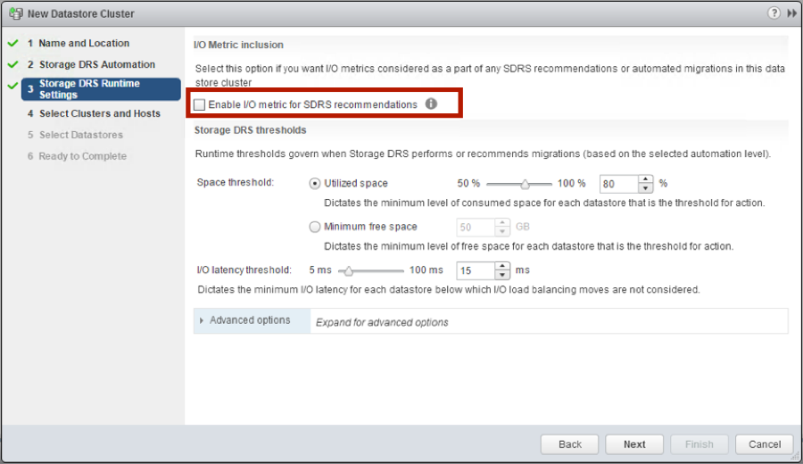
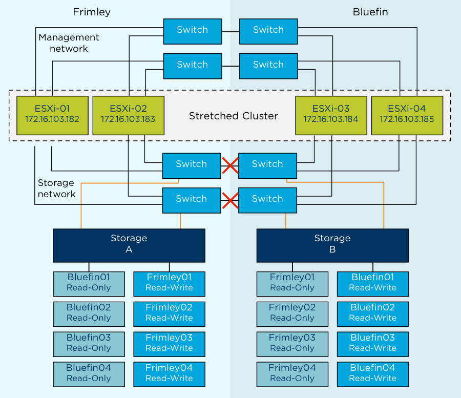
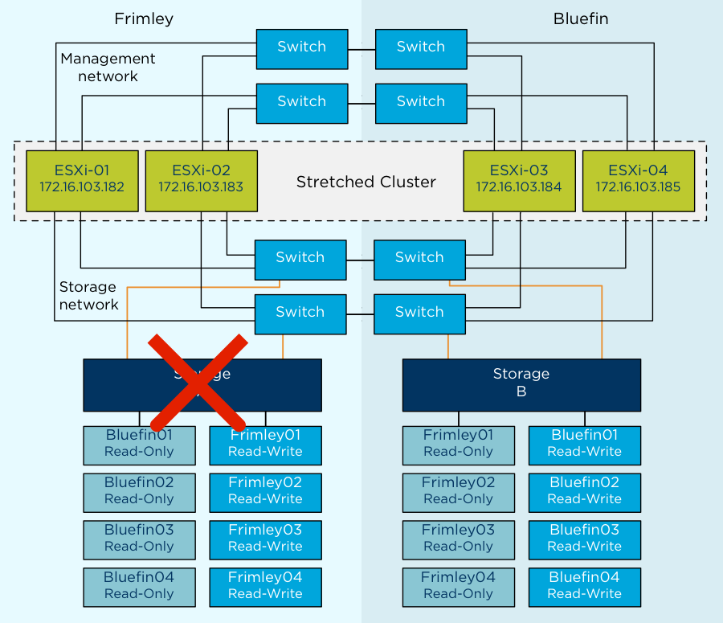

# Use Case: Stretched Cluster

In this part we will be discussing a specific infrastructure architecture and how HA, DRS and Storage DRS can be leveraged and should be deployed to increase availability. Be it availability of your workload or the resources provided to your workload, we will guide you through some of the design considerations and decision points along the way. Of course, a full understanding of your environment will be required in order to make appropriate decisions regarding specific implementation details. Nevertheless, we hope that this section will provide a proper understanding of how certain features play together and how these can be used to meet the requirements of your environment and build the desired architecture.

## Scenario {#scenario}

The scenario we have chosen is a stretched cluster also referred to as a VMware vSphere Metro Storage Cluster solution. We have chosen this specific scenario as it allows us to explain a multitude of design and architectural considerations. Although this scenario has been tested and validated in our lab, every environment is unique and our recommendations are based on our experience and your mileage may vary.

A VMware vSphere Metro Storage Cluster (vMSC) configuration is a VMware vSphere certified solution that combines synchronous replication with storage array based clustering. These solutions are typically deployed in environments where the distance between datacenters is limited, often metropolitan or campus environments.

The primary benefit of a stretched cluster model is to enable fully active and workload-balanced datacenters to be used to their full potential. Many customers find this architecture attractive due to the capability of migrating virtual machines with vMotion and Storage vMotion between sites. This enables on-demand and non-intrusive cross-site mobility of workloads. The capability of a stretched cluster to provide this active balancing of resources should always be the primary design and implementation goal.

Stretched cluster solutions offer the benefit of:

* Workload mobility
* Cross-site automated load balancing
* Enhanced downtime avoidance
* Disaster avoidance

### Technical requirements and constraints {#technical-requirements-and-constraints}

Due to the technical constraints of an online migration of VMs, the following specific requirements, which are listed in the VMware Compatibility Guide, must be met prior to consideration of a stretched cluster implementation:

* Storage connectivity using Fibre Channel, iSCSI, NFS, and FCoE is supported.
* The maximum supported network latency between sites for the VMware ESXi management networks is 10ms round-trip time (RTT).
* vMotion, and Storage vMotion, supports a maximum of 150ms latency as of vSphere 6.0, but this is not intended for stretched clustering usage.
* The maximum supported latency for synchronous storage replication links is 10ms RTT. Refer to documentation from the storage vendor because the maximum tolerated latency is lower in most cases. The most commonly supported maximum RTT is 5ms.
* The ESXi vSphere vMotion network has a redundant network link minimum of 250Mbps.

The storage requirements are slightly more complex. A vSphere Metro Storage Cluster requires what is in effect a **single storage subsystem** that spans both sites. In this design, a given datastore must be accessible—that is, be able to be read and be written to—simultaneously from both sites. Further, when problems occur, the ESXi hosts must be able to continue to access datastores from either array transparently and with no impact to ongoing storage operations.

This precludes traditional synchronous replication solutions because they create a primary–secondary relationship between the active (primary) LUN where data is being accessed and the secondary LUN that is receiving replication. To access the secondary LUN, replication is stopped, or reversed, and the LUN is made visible to hosts. This “promoted” secondary LUN has a completely different LUN ID and is essentially a newly available copy of a former primary LUN. This type of solution works for traditional disaster recovery–type configurations because it is expected that VMs must be started up on the secondary site. The vMSC configuration requires simultaneous, uninterrupted access to enable live migration of running VMs between sites.

The storage subsystem for a vMSC must be able to be read from and write to both locations simultaneously. All disk writes are committed synchronously at both locations to ensure that data is always consistent regardless of the location from which it is being read. This storage architecture requires significant bandwidth and very low latency between the sites in the cluster. Increased distances or latencies cause delays in writing to disk and a dramatic decline in performance. They also preclude successful vMotion migration between cluster nodes that reside in different locations.

## Uniform versus Non-Uniform {#uniform-versus-non-uniform}

vMSC solutions are classified into two distinct categories. These categories are based on a fundamental difference in how hosts access storage. It is important to understand the different types of stretched storage solutions because this influences design considerations. The following two main categories are as described on the VMware Hardware Compatibility List:

* Uniform host access configuration – ESXi hosts from both sites are all connected to a storage node in the storage cluster across all sites. Paths presented to ESXi hosts are stretched across a distance.
* Nonuniform host access configuration – ESXi hosts at each site are connected only to storage node(s) at the same site. Paths presented to ESXi hosts from storage nodes are limited to the local site.

The following in-depth descriptions of both categories clearly define them from architectural and implementation perspectives.

With **uniform** host access configuration, hosts in data center A and data center B have access to the storage systems in both data centers. In effect, the storage area network is stretched between the sites, and all hosts can access all LUNs. NetApp MetroCluster software is an example of uniform storage. In this configuration, read/write access to a LUN takes place on one of the two arrays, and a synchronous mirror is maintained in a hidden, read-only state on the second array. For example, if a LUN containing a datastore is read/write on the array in data center A, all ESXi hosts access that datastore via the array in data center A. For ESXi hosts in data center A, this is local access. ESXi hosts in data center B that are running VMs hosted on this datastore send read/write traffic across the network between data centers. In case of an outage or an operator-controlled shift of control of the LUN to data center B, all ESXi hosts continue to detect the identical LUN being presented, but it is now being accessed via the array in data center B.

The ideal situation is one in which VMs access a datastore that is controlled (read/write) by the array in the same data center. This minimizes traffic between data centers to avoid the performance impact of reads’ traversing the interconnect.

The notion of “site affinity” for a VM is dictated by the read/write copy of the datastore. “Site affinity” is also sometimes referred to as “site bias” or “LUN locality.” This means that when a VM has site affinity with data center A, its read/write copy of the datastore is located in data center A. This is explained in more detail in the “vSphere DRS” subsection of this section.


With **nonuniform** host access configuration, hosts in data center A have access only to the array within the local data center; the array, as well as its peer array in the opposite data center, is responsible for providing access to datastores in one data center to ESXi hosts in the opposite data center. EMC VPLEX is an example of a storage system that can be deployed as a nonuniform storage cluster, although it can also be configured in a uniform manner. VPLEX provides the concept of a “virtual LUN,” which enables ESXi hosts in each data center to read and write to the same datastore or LUN. VPLEX technology maintains the cache state on each array so ESXi hosts in either data center detect the LUN as local. EMC calls this solution “write anywhere.” Even when two VMs reside on the same datastore but are located in different data centers, they write locally without any performance impact on either VM. A key point with this configuration is that each LUN or datastore has “site affinity,” also sometimes referred to as “site bias” or “LUN locality.” In other words, if anything happens to the link between the sites, the storage system on the preferred site for a given datastore will be the only one remaining with read/write access to it. This prevents any data corruption in case of a failure scenario.


Our examples use uniform storage because these configurations are currently the most commonly deployed. Many of the design considerations, however, also apply to nonuniform configurations. We point out exceptions when this is not the case.

## Scenario Architecture {#scenario-architecture}

In this section we will describe the architecture deployed for this scenario. We will also discuss some of the basic configuration and behavior of the various vSphere features. For an in-depth explanation of each respective feature, refer to the HA and the DRS section of this book. We will make specific recommendations based on VMware best practices and provide operational guidance where applicable. In our failure scenarios it will be explained how these practices prevent or limit downtime.

### Infrastructure {#infrastructure}

The described infrastructure consists of a single vSphere 6.0 cluster with four ESXi 6.0 hosts. These hosts are managed by a single vCenter Server 6.0 instance. The first site is called Frimley; the second site is called Bluefin. The network between Frimley data center and Bluefin data center is a stretched layer 2 network. There is a minimal distance between the sites, as is typical in campus cluster scenarios.

Each site has two ESXi hosts, and the vCenter Server instance is configured with vSphere DRS affinity to the hosts in Bluefin data center. In a stretched cluster environment, only a single vCenter Server instance is used. This is different from a traditional VMware Site Recovery Manager™ configuration in which a dual vCenter Server configuration is required. The configuration of VM-to-host affinity rules is discussed in more detail in the “vSphere DRS” subsection of this document.

Eight LUNs are depicted the diagram below. Four of these are accessed through the virtual IP address active on the iSCSI storage system in the Frimley data center; four are accessed through the virtual IP address active on the iSCSI storage system in the Bluefin data center.


| **Location** | **Hosts** | **Datastores** | **Local Isolation Address** |
| --- | --- | --- | --- |
| Bluefin | 172.16.103.184 | Bluefin01 | 172.16.103.10 |
|  | 172.16.103.185 | Bluefin02 | n/a |
|  |  | Bluefin03 | n/a |
|  |  | Bluefin04 | n/a |
| Frimley | 172.16.103.182 | Frimley01 | 172.16.103.11 |
|  | 172.16.103.183 | Frimley02 | n/a |
|  |  | Frimley03 | n/a |
|  |  | Frimley04 | n/a |

The vSphere cluster is connected to a stretched storage system in a fabric configuration with a uniform device access model. This means that every host in the cluster is connected to both storage heads. Each of the heads is connected to two switches, which are connected to two similar switches in the secondary location. For any given LUN, one of the two storage heads presents the LUN as read/write via iSCSI. The other storage head maintains the replicated, read-only copy that is effectively hidden from the ESXi hosts.

## vSphere Configuration {#vsphere-configuration}

Our focus in this section is on vSphere HA, vSphere DRS, and vSphere Storage DRS in relation to stretched cluster environments. Design and operational considerations regarding vSphere are commonly overlooked and underestimated. Much emphasis has traditionally been placed on the storage layer, but little attention has been applied to how workloads are provisioned and managed.

One of the key drivers for using a stretched cluster is workload balance and disaster avoidance. How do we ensure that our environment is properly balanced without impacting availability or severely increasing the operational expenditure? How do we build the requirements into our provisioning process and validate periodically that we still meet them? Ignoring the requirements makes the environment confusing to administrate and less predictable during the various failure scenarios for which it should be of help.

Each of these three vSphere features has very specific configuration requirements and can enhance environment resiliency and workload availability. Architectural recommendations based on our findings during the testing of the various failure scenarios are given throughout this section.

### vSphere HA {#vsphere-ha}

The environment has four hosts and a uniform stretched storage solution. A full site failure is one scenario that must be taken into account in a resilient architecture. VMware recommends enabling vSphere HA admission control. Workload availability is the primary driver for most stretched cluster environments, so providing sufficient capacity for a full site failure is recommended. Such hosts are equally divided across both sites. To ensure that all workloads can be restarted by vSphere HA on just one site, configuring the admission control policy to 50 percent for both memory and CPU is recommended.

VMware recommends using a percentage-based policy because it offers the most flexibility and reduces operational overhead. Even when new hosts are introduced to the environment, there is no need to change the percentage and no risk of a skewed consolidation ratio due to possible use of VM-level reservations. 

The screenshot below shows a vSphere HA cluster configured with admission control enabled and with the percentage-based policy set to 50 percent.


vSphere HA uses heartbeat mechanisms to validate the state of a host. There are two such mechanisms: network heartbeating and datastore heartbeating. Network heartbeating is the primary mechanism for vSphere HA to validate availability of the hosts. Datastore heartbeating is the secondary mechanism used by vSphere HA; it determines the exact state of the host after network heartbeating has failed.

If a host is not receiving any heartbeats, it uses a fail-safe mechanism to detect if it is merely isolated from its master node or completely isolated from the network. It does this by pinging the default gateway. In addition to this mechanism, one or more isolation addresses can be specified manually to enhance reliability of isolation validation. VMware recommends specifying a minimum of two additional isolation addresses, with each address site local.

In our scenario, one of these addresses physically resides in the Frimley data center; the other physically resides in the Bluefin data center. This enables vSphere HA validation for complete network isolation, even in case of a connection failure between sites. The next screenshot shows an example of how to configure multiple isolation addresses. The vSphere HA advanced setting used is _das.isolationaddress_. More details on how to configure this can be found in [VMware Knowledge Base article 1002117](http://kb.vmware.com/kb/1002117).

The minimum number of heartbeat datastores is two and the maximum is five. For vSphere HA datastore heartbeating to function correctly in any type of failure scenario, VMware recommends increasing the number of heartbeat datastores from two to four in a stretched cluster environment. This provides full redundancy for both data center locations. Defining four specific datastores as preferred heartbeat datastores is also recommended, selecting two from one site and two from the other. This enables vSphere HA to heartbeat to a datastore even in the case of a connection failure between sites. Subsequently, it enables vSphere HA to determine the state of a host in any scenario.

Adding an advanced setting called _das.heartbeatDsPerHost_ can increase the number of heartbeat datastores. This is shown in the screenshot below.


To designate specific datastores as heartbeat devices,VMware recommends using **Select any of the cluster datastores taking into account my preferences**. This enables vSphere HA to select any other datastore if the four designated datastores that have been manually selected become unavailable. VMware recommends selecting two datastores in each location to ensure that datastores are available at each site in the case of a site partition.


### Permanent Device Loss and All Paths Down Scenarios {#permanent-device-loss-and-all-paths-down-scenarios}

As of vSphere 6.0, enhancements have been introduced to enable an automated failover of VMs residing on a datastore that has either an all paths down (APD) or a permanent device loss (PDL) condition. PDL is applicable only to block storage devices.

A PDL condition, as is discussed in one of our failure scenarios, is a condition that is communicated by the array controller to the ESXi host via a SCSI sense code. This condition indicates that a device (LUN) has become unavailable and is likely permanently unavailable. An example scenario in which this condition is communicated by the array is when a LUN is set offline. This condition is used in nonuniform models during a failure scenario to ensure that the ESXi host takes appropriate action when access to a LUN is revoked. When a full storage failure occurs, it is impossible to generate the PDL condition because there is no communication possible between the array and the ESXi host. This state is identified by the ESXi host as an APD condition. Another example of an APD condition is where the storage network has failed completely. In this scenario, the ESXi host also does not detect what has happened with the storage and declares an APD.

To enable vSphere HA to respond to both an APD and a PDL condition, vSphere HA must be configured in a specific way. VMware recommends enabling VM Component Protection (VMCP). After the creation of the cluster, VMCP must be enabled, as is shown below.


The configuration screen can be found as follows:

* Log in to VMware vSphere Web Client.
* Click **Hosts and Clusters**.
* Click the cluster object.
* Click the **Manage** tab.
* Click **vSphere HA** and then **Edit**.
* Select **Protect against Storage Connectivity Loss**.
* Select individual functionality, as described in the following, by opening **Failure conditions and VM response**.

The configuration for PDL is basic. In the **Failure conditions and VM response** section, the response following detection of a PDL condition can be configured. VMware recommends setting this to **Power off and restart VMs**. When this condition is detected, a VM is restarted instantly on a healthy host within the vSphere HA cluster.

For an APD scenario, configuration must occur in the same section, as is shown in thr screenshot below. Besides defining the response to an APD condition, it is also possible to alter the timing and to configure the behavior when the failure is restored before the APD timeout has passed.


When an APD condition is detected, a timer is started. After 140 seconds, the APD condition is officially declared and the device is marked as APD timeout. When 140 seconds have passed, vSphere HA starts counting. The default vSphere HA timeout is 3 minutes. When the 3 minutes have passed, vSphere HA restarts the impacted VMs, but VMCP can be configured to respond differently if preferred. VMware recommends configuring it to **Power off and restart VMs (conservative)**.

_Conservative_ refers to the likelihood that vSphere HA will be able to restart VMs. When set to conservative, vSphere HA restarts only the VM that is impacted by the APD if it detects that a host in the cluster can access the datastore on which the VM resides. In the case of _aggressive_, vSphere HA attempts to restart the VM even if it doesn’t detect the state of the other hosts. This can lead to a situation in which a VM is not restarted because there is no host that has access to the datastore on which the VM is located.

If the APD is lifted and access to the storage is restored before the timeout has passed, vSphere HA does not unnecessarily restart the VM unless explicitly configured to do so. If a response is chosen even when the environment has recovered from the APD condition, **Response for APD recovery after APD timeout** can be configured to **Reset VMs**. VMware recommends leaving this setting disabled.

With the release of vSphere 5.5, an advanced setting called **Disk.AutoremoveOnPDL** was introduced. It is implemented by default. This functionality enables vSphere to remove devices that are marked as PDL and helps prevent reaching, for example, the 256-device limit for an ESXi host. However, if the PDL scenario is solved and the device returns, the ESXi host’s storage system must be rescanned before this device appears. VMware recommends disabling **Disk.AutoremoveOnPDL** in the host advanced settings by setting it to **0**.


### vSphere DRS {#vsphere-drs}

vSphere DRS is used in many environments to distribute load within a cluster. It offers many other features that can be very helpful in stretched cluster environments. VMware recommends enabling vSphere DRS to facilitate load balancing across hosts in the cluster. The vSphere DRS load-balancing calculation is based on CPU and memory use. Care should be taken with regard to both storage and networking resources as well as to traffic flow. To avoid storage and network traffic overhead in a stretched cluster environment, VMware recommends implementing vSphere DRS affinity rules to enable a logical separation of VMs. This subsequently helps improve availability. For VMs that are responsible for infrastructure services, such as Microsoft Active Directory and DNS, it assists by ensuring separation of these services across sites.

vSphere DRS affinity rules also help prevent unnecessary downtime, and storage and network traffic flow overhead, by enforcing preferred site affinity. VMware recommends aligning vSphere VM-to-host affinity rules with the storage configuration—that is, setting VM-to-host affinity rules with a preference that a VM run on a host at the same site as the array that is configured as the primary read/write node for a given datastore. For example, in our test configuration, VMs stored on the Frimley01 datastore are set with VM-to-host affinity with a preference for hosts in the Frimley data center. This ensures that in the case of a network connection failure between sites, VMs do not lose connection with the storage system that is primary for their datastore. VM-to-host affinity rules aim to ensure that VMs stay local to the storage primary for that datastore. This coincidentally also results in all read I/O’s staying local.

**_NOTE:_ **_Different storage vendors use different terminology to describe the relationship of a LUN to a particular array or controller. For the purposes of this document, we use the generic term “storage site affinity,” which refers to the preferred location for access to a given LUN._

VMware recommends implementing “should rules” because these are violated by vSphere HA in the case of a full site failure. Availability of services should always prevail. In the case of “must rules,” vSphere HA does not violate the rule set, and this can potentially lead to service outages. In the scenario where a full data center fails, “must rules” do not allow vSphere HA to restart the VMs, because they do not have the required affinity to start on the hosts in the other data center. This necessitates the recommendation to implement “should rules.” vSphere DRS communicates these rules to vSphere HA, and these are stored in a “compatibility list” governing allowed start-up. If a single host fails, VM-to-host “should rules” are ignored by default. VMware recommends configuring vSphere HA rule settings to respect VM-to-host affinity rules where possible. With a full site failure, vSphere HA can restart the VMs on hosts that violate the rules. Availability takes preference in this scenario.


Under certain circumstances, such as massive host saturation coupled with aggressive recommendation settings, vSphere DRS can also violate “should rules.” Although this is very rare, we recommend monitoring for violation of these rules because a violation might impact availability and workload performance.

VMware recommends manually defining “sites” by creating a group of hosts that belong to a site and then adding VMs to these sites based on the affinity of the datastore on which they are provisioned. In our scenario, only a limited number of VMs were provisioned. VMware recommends automating the process of defining site affinity by using tools such as VMware vCenter Orchestrator™ or VMware vSphere PowerCLI™. If automating the process is not an option, use of a generic naming convention is recommended to simplify the creation of these groups. VMware recommends that these groups be validated on a regular basis to ensure that all VMs belong to the group with the correct site affinity.

The following screenshots depict the configuration used for our scenario. In the first screenshot, all VMs that should remain local to the Bluefin data center are added to the Bluefin VM group.


Next, a Bluefin host group is created that contains all hosts residing in this location.


Next, a new rule is created that is defined as a “should run on rule.” It links the host group and the VM group for the Bluefin location.


This should be done for both locations, which should result in two rules.


### Correcting Affinity Rule Violation {#correcting-affinity-rule-violation}

vSphere DRS assigns a high priority to correcting affinity rule violations. During invocation, the primary goal of vSphere DRS is to correct any violations and generate recommendations to migrate VMs to the hosts listed in the host group. These migrations have a higher priority than load-balancing moves and are started before them.

vSphere DRS is invoked every 5 minutes by default, but it is also triggered if the cluster detects changes. For instance, when a host reconnects to the cluster, vSphere DRS is invoked and generates recommendations to correct the violation. Our testing has shown that vSphere DRS generates recommendations to correct affinity rules violations within 30 seconds after a host reconnects to the cluster. vSphere DRS is limited by the overall capacity of the vSphere vMotion network, so it might take multiple invocations before all affinity rule violations are corrected.

### vSphere Storage DRS {#vsphere-storage-drs}

vSphere Storage DRS enables aggregation of datastores to a single unit of consumption from an administrative perspective, and it balances VM disks when defined thresholds are exceeded. It ensures that sufficient disk resources are available to a workload. VMware recommends enabling vSphere Storage DRS with I/O Metric disabled. The use of I/O Metric or VMware vSphere Storage I/O Control is not supported in a vMSC configuration, as is described in VMware Knowledge Base article 2042596.



vSphere Storage DRS uses vSphere Storage vMotion to migrate VM disks between datastores within a datastore cluster. Because the underlying stretched storage systems use synchronous replication, a migration or series of migrations have an impact on replication traffic and might cause the VMs to become temporarily unavailable due to contention for network resources during the movement of disks. Migration to random datastores can also potentially lead to additional I/O latency in uniform host access configurations if VMs are not migrated along with their virtual disks. For example, if a VM residing on a host at site A has its disk migrated to a datastore at site B, it continues operating but with potentially degraded performance. The VM’s disk reads now are subject to the increased latency associated with reading from the virtual iSCSI IP at site B. Reads are subject to intersite latency rather than being satisfied by a local target.

To control if and when migrations occur, VMware recommends configuring vSphere Storage DRS in manual mode. This enables human validation per recommendation as well as recommendations to be applied during off-peak hours, while gaining the operational benefit and efficiency of the initial placement functionality.

VMware recommends creating datastore clusters based on the storage configuration with respect to storage site affinity. Datastores with a site affinity for site A should not be mixed in datastore clusters with datastores with a site affinity for site B. This enables operational consistency and eases the creation and ongoing management of vSphere DRS VM-to-host affinity rules. Ensure that all vSphere DRS VM-to-host affinity rules are updated accordingly when VMs are migrated via vSphere Storage vMotion between datastore clusters and when crossing defined storage site affinity boundaries. To simplify the provisioning process, VMware recommends aligning naming conventions for datastore clusters and VM-to-host affinity rules.


The naming convention used in our testing gives both datastores and datastore clusters a site-specific name to provide ease of alignment of vSphere DRS host affinity with VM deployment in the correlate site.

# Failure Scenarios {#failure-scenarios}

There are many failures that can be introduced in clustered systems. But in a properly architected environment, vSphere HA, vSphere DRS, and the storage subsystem do not detect many of these. We do not address the zero-impact failures, such as the failure of a single network cable, because they are explained in depth in the documentation provided by the storage vendor of the various solutions. We discuss the following “common” failure scenarios:

* Single-host failure in Frimley data center
* Single-host isolation in Frimley data center
* Storage partition
* Data center partition
* Disk shelf failure in Frimley data center
* Full storage failure in Frimley data center
* Full compute failure in Frimley data center
* Full compute failure in Frimley data center and full storage failure in Bluefin data center
* Loss of complete Frimley data center

We also examine scenarios in which specific settings are incorrectly configured. These settings determine the availability and recoverability of VMs in a failure scenario. It is important to understand the impact of misconfigurations such as the following:

* Incorrectly configured VM-to-host affinity rules
* Incorrectly configured heartbeat datastores
* Incorrectly configured isolation address
* Incorrectly configured PDL handling
* vCenter Server split-brain scenario

### Single-Host Failure in Frimley Data Center {#single-host-failure-in-frimley-data-center}

In this scenario, we describe the complete failure of a host in Frimley data center. This scenario is depicted below.


**Result:** vSphere HA successfully restarted all VMs in accordance with VM-to-host affinity rules.

**Explanation:** If a host fails, the cluster’s vSphere HA master node detects the failure because it no longer is receiving network heartbeats from the host. Then the master starts monitoring for datastore heartbeats. Because the host has failed completely, it cannot generate datastore heartbeats; these too are detected as missing by the vSphere HA master node. During this time, a third availability check—pinging the management addresses of the failed hosts—is conducted. If all of these checks return as unsuccessful, the master declares the missing host as dead and attempts to restart all the protected VMs that had been running on the host before the master lost contact with the host.

The vSphere VM-to-host affinity rules defined on a cluster level are “should rules.” vSphere HA VM-to-host affinity rules should be respected so all VMs are restarted within the correct site.

However, if the host elements of the VM-to-host group are temporarily without resources, or if they are unavailable for restarts for any other reason, vSphere HA can disregard the rules and restart the remaining VMs on any of the remaining hosts in the cluster, regardless of location and rules. If this occurs, vSphere DRS attempts to correct any violated affinity rules at the first invocation and automatically migrates VMs in accordance with their affinity rules to bring VM placement in alignment. VMware recommends manually invoking vSphere DRS after the cause for the failure has been identified and resolved. This ensures that all VMs are placed on hosts in the correct location to avoid possible performance degradation due to misplacement.

### Single-Host Isolation in Frimley Data Center {#single-host-isolation-in-frimley-data-center}

In this scenario, we describe the response to isolation of a single host in Frimley data center from the rest of the network.


**Result:** VMs remain running because isolation response is configured to **leave powered on**.

**Explanation:** When a host is isolated, the vSphere HA master node detects the isolation because it no longer is receiving network heartbeats from the host. Then the master starts monitoring for datastore heartbeats. Because the host is isolated, it generates datastore heartbeats for the secondary vSphere HA detection mechanism. Detection of valid host heartbeats enables the vSphere HA master node to determine that the host is running but is isolated from the network. Depending on the isolation response configured, the impacted host can power off or shut down VMs or can leave them powered on. The isolation response is triggered 30 seconds after the host has detected that it is isolated.

VMware recommends aligning the isolation response to business requirements and physical constraints. From a best practices perspective, **leave powered on** is the recommended isolation response setting for the majority of environments. Isolated hosts are rare in a properly architected environment, given the built-in redundancy of most modern designs. In environments that use network-based storage protocols, such as iSCSI and NFS, and where networks are converged, the recommended isolation response is **power off**. In these environments, it is more likely that a network outage that causes a host to become isolated also affects the host’s ability to communicate to the datastores.

If an isolation response different from the recommended **leave powered on** is selected and a **power off** or **shut down** response is triggered, the vSphere HA master restarts VMs on the remaining nodes in the cluster. The vSphere VM-to-host affinity rules defined on a cluster level are “should rules.” However, because the vSphere HA rule settings specify that the vSphere HA VM-to-host affinity rules should be respected, all VMs are restarted within the correct site under “normal” circumstances.

### Storage Partition {#storage-partition}

In this scenario, a failure has occurred on the storage network between data centers, as is depicted below.



**Result:** VMs remain running with no impact.

**Explanation:** Storage site affinity is defined for each LUN, and vSphere DRS rules align with this affinity. Therefore, because storage remains available within the site, no VM is impacted.

If for any reason the affinity rule for a VM has been violated and the VM is running on a host in Frimley data center while its disk resides on a datastore that has affinity with Bluefin data center, it cannot successfully issue I/O following an intersite storage partition. This is because the datastore is in an APD condition. In this scenario, the VM can be restarted because vSphere HA is configured to respond to APD conditions. The response occurs after the 3-minute grace period has passed. This 3-minute period starts after the APD timeout of 140 seconds has passed and the APD condition has been declared.

To avoid unnecessary downtime in an APD scenario, VMware recommends monitoring compliance of vSphere DRS rules. Although vSphere DRS is invoked every 5 minutes, this does not guarantee resolution of all affinity rule violations. Therefore, to prevent unnecessary downtime, rigid monitoring is recommended that enables quick identification of anomalies such as a VM’s compute’s residing in one site while its storage resides in the other site.

### Data Center Partition {#data-center-partition}

In this scenario, the Frimley data center is isolated from the Bluefin data center, as is depicted below.


**Result:** VMs remain running with no impact.

**Explanation:** In this scenario, the two data centers are fully isolated from each other. This scenario is similar to both the storage partition and the host isolation scenario. VMs are not impacted by this failure because vSphere DRS rules were correctly implemented and no rules were violated.

vSphere HA follows this logical process to determine which VMs require restarting during a cluster partition:

The vSphere HA master node running in Frimley data center detects that all hosts in Bluefin data center are unreachable. It first detects that no network heartbeats are being received. It then determines whether any storage heartbeats are being generated. This check does not detect storage heartbeats because the storage connection between sites also has failed, and the heartbeat datastores are updated only “locally.” Because the VMs with affinity to the remaining hosts are still running, no action is needed for them. Next, vSphere HA determines whether a restart can be attempted. However, the read/write version of the datastores located in Bluefin data center are not accessible by the hosts in Frimley data center. Therefore, no attempt is made to start the missing VMs.

Similarly, the ESXi hosts in Bluefin data center detect that there is no master available, and they initiate a master election process. After the master has been elected, it tries to determine which VMs had been running before the failure and it attempts to restart them. Because all VMs with affinity to Bluefin data center are still running there, there is no need for a restart. Only the VMs with affinity to Frimley data center are unavailable, and vSphere HA cannot restart them because the datastores on which they are stored have affinity with Frimley data center and are unavailable in Bluefin data center.

If VM-to-host affinity rules have been violated—that is, VMs have been running at a location where their storage is not defined as read/write by default—the behavior changes. The following sequence describes what would happen in that case:

1. The VM with affinity to Frimley data center but residing in Bluefin data center is unable to reach its datastore. This results in the VM’s being unable to write to or read from disk.
2. In Frimley data center, this VM is restarted by vSphere HA because the hosts in Frimley data center do not detect the instance’s running in Bluefin data center.
3. Because the datastore is available only to Frimley data center, one of the hosts in Frimley data center acquires a lock on the VMDK and is able to power on this VM.
4. This can result in a scenario in which the same VM is powered on and running in both data centers.


If the APD response is configured to **Power off and restart VMs (aggressive)**, as is recommended in the VM Component Protection section of this white paper, the VM is powered off after the APD timeout and the grace period have passed. This behavior is new in vSphere 6.0.

If the APD response is not correctly configured, two VMs will be running, for the following possible reasons:

* The network heartbeat from the host that is running this VM is missing because there is no connection to that site.
* The datastore heartbeat is missing because there is no connection to that site.
* A ping to the management address of the host that is running the VM fails because there is no connection to that site.
* The master located in Frimley data center detects that the VM had been powered on before the failure. Because it is unable to communicate with the VM’s host in Bluefin data center after the failure, it attempts to restart the VM because it cannot detect the actual state.

If the connection between sites is restored, a classic “VM split-brain scenario” will exist. For a short period of time, two copies of the VM will be active on the network, with both having the same MAC address. Only one copy, however, will have access to the VM files, and vSphere HA will detect this. As soon as this is detected, all processes belonging to the VM copy that has no access to the VM files will be killed, as is depicted below.


In this example, the downtime equates to a VM’s having to be restarted. Proper maintenance of site affinity can prevent this. To avoid unnecessary downtime, VMware recommends close monitoring to ensure that vSphere DRS rules align with datastore site affinity.

### Disk Shelf Failure in Frimley Data Center {#disk-shelf-failure-in-frimley-data-center}

In this scenario, one of the disk shelves in Frimley data center has failed. Both Frimley01 and Frimley02 on storage A are impacted.


**Result:** VMs remain running with no impact.

**Explanation:** In this scenario, only a disk shelf in Frimley data center has failed. The storage processor has detected the failure and has instantly switched from the primary disk shelf in Frimley data center to the mirror copy in Bluefin data center. There is no noticeable impact to any of the VMs except for a typical short spike in I/O response time. The storage solution fully detects and handles this scenario. There is no need for a rescan of the datastores or the HBAs because the switchover is seamless and the LUNs are identical from the ESXi perspective.

### Full Storage Failure in Frimley Data Center {#full-storage-failure-in-frimley-data-center}

In this scenario, a full storage system failure has occurred in Frimley data center.



**Result:** VMs remain running with no impact**.**

**Explanation:** When the full storage system fails in Frimley data center, a **take over** command must be initiated manually. As described previously, we used a NetApp MetroCluster configuration to describe this behavior. This **take over** command is particular to NetApp environments; depending on the implemented storage system, the required procedure can differ. After the command has been initiated, the mirrored, read-only copy of each of the failed datastores is set to read/write and is instantly accessible. We have described this process on an extremely high level. For more details, refer to the storage vendor’s documentation.

From the VM perspective, this failover is seamless: The storage controllers handle this, and no action is required from either the vSphere or storage administrator. All I/O now passes across the intrasite connection to the other data center because VMs remain running in Frimley data center while their datastores are accessible only in Bluefin data center.

vSphere HA does not detect this type of failure. Although the datastore heartbeat might be lost briefly, vSphere HA does not take action because the vSphere HA master agent checks for the datastore heartbeat only when the network heartbeat is not received for 3 seconds. Because the network heartbeat remains available throughout the storage failure, vSphere HA is not required to initiate any restarts.

###Permanent Device Loss
In the scenario shown the diagram below, a permanent device loss (PDL) condition occurs because datastore Frimley01 has been taken offline for ESXi-01 and ESXi-02\. PDL scenarios are uncommon in uniform configurations and are more likely to occur in a nonuniform vMSC configuration. However, a PDL scenario can, for instance, occur when the configuration of a storage group changes as in the case of this described scenario.


**Result:** VMs are restarted by vSphere HA on ESXi-03 and ESXi-04.

**Explanation:** When the PDL condition occurs, VMs running on datastore Frimley01 on hosts ESXi-01 and ESXi-02 are killed instantly. They then are restarted by vSphere HA on hosts within the cluster that have access to the datastore, ESXi-03 and ESXi-04 in this scenario. The PDL and killing of the VM world group can be witnessed by following the entries in the vmkernel.log file located in /var/log/ on the ESXi hosts. The following is an outtake of the vmkernel.log file where a PDL is recognized and appropriate action is taken.

```2012-03-14T13:39:25.085Z cpu7:4499)WARNING: VSCSI: 4055: handle 8198(vscsi4:0):opened by wid 4499 (vmm0:fri-iscsi-02) has Permanent Device Loss. Killing world group leader 4491```

VMware recommends configuring **Response for Datastore with Permanent Device Loss (PDL)** to **Power off and restart VMs**. This setting ensures that appropriate action is taken when a PDL condition exists. The correct configuration is shown below.


### Full Compute Failure in Frimley Data Center {#full-compute-failure-in-frimley-data-center}

In this scenario, a full compute failure has occurred in Frimley data center.


**Result**: All VMs are successfully restarted in Bluefin data center**.**

**Explanation:** The vSphere HA master was located in Frimley data center at the time of the full compute failure at that location. After the hosts in Bluefin data center detected that no network heartbeats had been received, an election process was started. Within approximately 20 seconds, a new vSphere HA master was elected from the remaining hosts. Then the new master determined which hosts had failed and which VMs had been impacted by this failure. Because all hosts at the other site had failed and all VMs residing on them had been impacted, vSphere HA initiated the restart of all of these VMs. vSphere HA can initiate 32 concurrent restarts on a single host, providing a low restart latency for most environments. The only sequencing of start order comes from the broad _high_, _medium_, and _low_ categories for vSphere HA. This policy must be set on a per-VM basis. These policies were determined to have been adhered to; high-priority VMs started first, followed by medium-priority and low-priority VMs.

As part of the test, the hosts at the Frimley data center were again powered on. As soon as vSphere DRS detected that these hosts were available, a vSphere DRS run was invoked. Because the initial vSphere DRS run corrects only the vSphere DRS affinity rule violations, resource imbalance was not correct until the next full invocation of vSphere DRS. vSphere DRS is invoked by default every 5 minutes or when VMs are powered off or on through the use of the vCenter Web Client.

### Loss of Frimley Data Center {#loss-of-frimley-data-center}

In this scenario, a full failure of Frimley data center is simulated.


**Result:** All VMs were successfully restarted in Bluefin data center**.**

**Explanation:** In this scenario, the hosts in Bluefin data center lost contact with the vSphere HA master and elected a new vSphere HA master. Because the storage system had failed, a **take over** command had to be initiated on the surviving site, again due to the NetApp-specific process. After the **take over** command had been initiated, the new vSphere HA master accessed the per-datastore files that vSphere HA uses to record the set of protected VMs. The vSphere HA master then attempted to restart the VMs that were not running on the surviving hosts in Bluefin data center. In our scenario, all VMs were restarted within 2 minutes after failure and were fully accessible and functional again.

**_NOTE:_ **_By default, vSphere HA stops attempting to start a VM after 30 minutes. If the storage team does not issue a takeover command within that time frame, the vSphere administrator must manually start up VMs after the storage becomes available._

# Stretched Cluster using VSAN {#vsphere-metro-storage-cluster-using-vsan}

This question keeps on coming up over and over again lately, Stretched Cluster using Virtual SAN, can I do it? When Virtual SAN was first released the answer to this question was a clear **no**, Virtual SAN did not allow a "traditional" stretched deployment using 2 "data" sites and a third "witness" site. A regular Virtual SAN cluster stretched across 3 sites within campus distance however was possible. With Virtual SAN 6.1 however introduced the "traditional" stretched cluster deployment support.

Everything learned in this publication also applies to a stretched Virtual SAN cluster, with that meaning all HA and DRS best practices. There are a couple of differences though at the time of writing between a vSphere Metro Storage Cluster and a VSAN Stretched Cluster and in this section we will call out these difference. Please note that there is an extensive Virtual SAN Stretched Clustering available written by Cormac Hogan and there is a full Virtual SAN book available written by Cormac Hogan an myself (Duncan Epping). If you want to know more details about Virtual SAN we would like to refer to these two publications.

***BEING WORKED ON***


