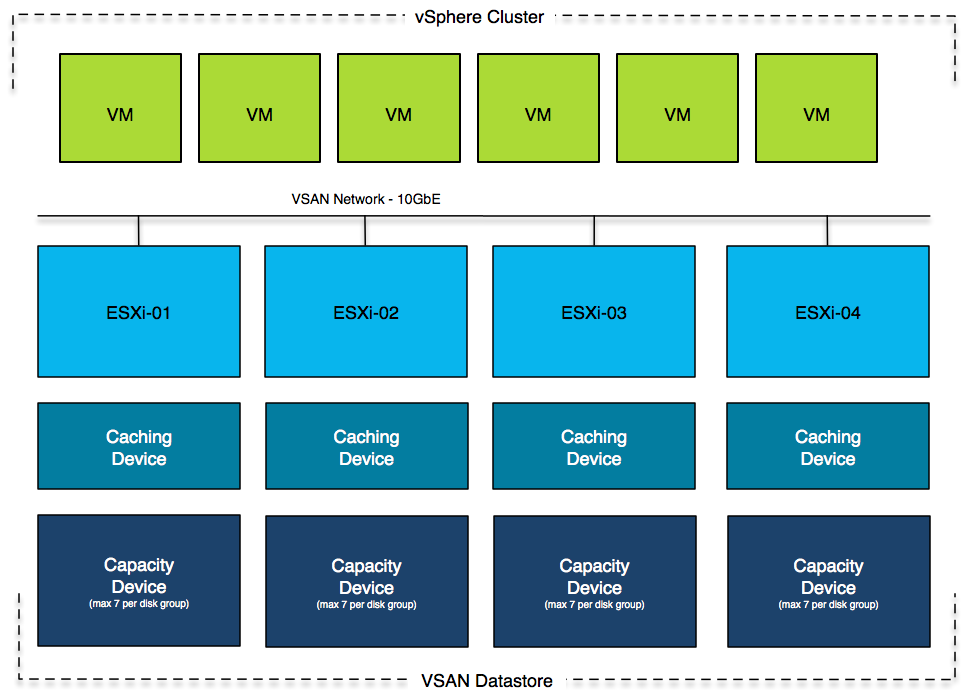
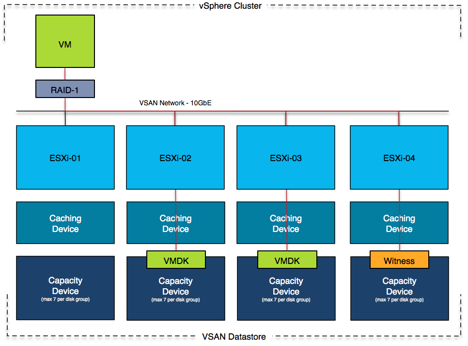
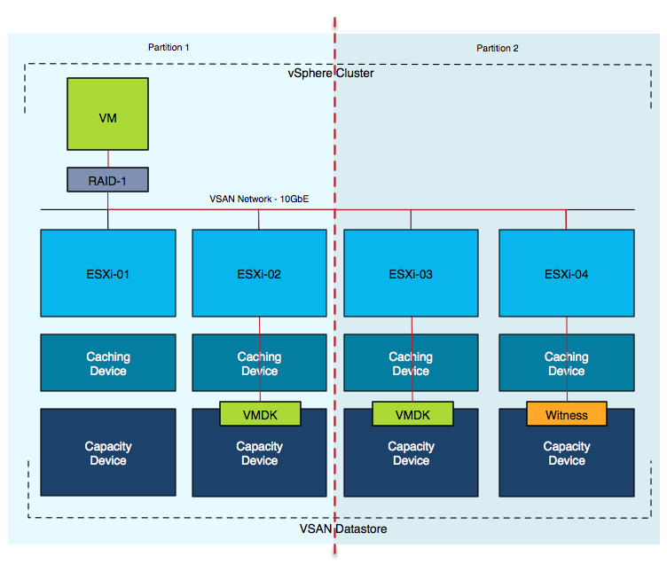

# Virtual SAN and Virtual Volumes specifics

In the last couple of sections we have discussed the ins and out of HA. All of it based on VMFS based or NFS based storage. With the introduction of Virtual SAN and Virtual Volumes also comes changes to some of the discussed concepts.

## HA and Virtual SAN
Virtual SAN is VMware’s approach to Software Defined Storage. We are not going to explain the ins and outs of Virtual SAN, but do want to provide a basic understanding for those who have never done anything with it. Virtual SAN leverages host local storage and creates a shared data store out of it.

Virtual SAN requires a minimum of 3 hosts and each of those 3 hosts will need to have 1 SSD for caching and 1 capacity device (can be SSD or HDD). Only the capacity devices will contribute to the available capacity of the datastore. If you have 1TB worth of capacity devices per host then with three hosts the total size of your datastore will be 3TB.

Having that said, with Virtual SAN 6.1 VMware introduced a "2-node" option. This 2-node option is actually 2 regular VSAN nodes with a third "witness" node. 

The big differentiator between most storage systems and Virtual SAN is that availability of the virtual machine’s is defined on a per virtual disk or per virtual machine basis. This is called “Failures To Tolerate” and can be configured to any value between 0 (zero) and 3\. When configured to 0 then the virtual machine will have only 1 copy of its virtual disks which means that if a host fails where the virtual disks are stored the virtual machine is lost. As such all virtual machines are deployed by default with Failures To Tolerate(FTT) set to 1. A virtual disk is what VSAN refers to as an object. An object, when FTT is configured as 1 or higher, has multiple components. In the diagram below we demonstrate the FTT=1 scenario, and the virtual disk in this case has 2 "data components" and a "witness components". The witness is used as a "quorom" mechnanism.

As the diagram above depicts, a virtual machine can be running on the first host while its storage components are on the remaining hosts in the cluster. As you can imagine from an HA point of view this changes things as access to the network is not only critical for HA to function correctly but also for Virtual SAN. When it comes to networking note that when Virtual SAN is configured in a cluster HA will use the same network for its communications (heartbeating etc). On top of that, it is good to know that VMware highly recommends 10GbE to be used for Virtual SAN.

>**Basic design principle:** 10GbE is highly recommend for Virtual SAN, as vSphere HA also leverages the Virtual SAN network and availability of VMs is dependent on network connectivity ensure that at a minimum two 10GbE ports are used and two physical switches for resiliency.

The reason that HA uses the same network as Virtual SAN is simple, it is too avoid network partition scenarios where HA communications is separated from Virtual SAN and the state of the cluster is unclear. Note that you will need to ensure that there is a pingable isolation address on the Virtual SAN network and this isolation address will need to be configured as such through the use of the advanced setting “das.isolationAddress0”. We also recommend to disable the use of the default isolation address through the advanced setting “das.useDefaultIsolationAddress” (set to false).

When an isolation does occur the isolation response is triggered as explained in earlier chapters. For Virtual SAN the recommendation is simple, configure the isolation response to “Power Off, then fail over”. This is the safest option. Virtual SAN can be compared to the “converged network with IP based storage” example we provided. It is very easy to reach a situation where a host is isolated all virtual machines remain running but are restarted on another host because the connection to the Virtual SAN datastore is lost.

>**Basic design principle:** Configure your Isolation Address and your Isolation Policy accordingly. We recommend selecting “power off” as the Isolation Policy and a reliable pingable device as the isolation address. It is recommended to configure the Isolation Policy to “power off”.

What about things like heartbeat datastores and the folder structure that exists on a VMFS datastore, has any of that changed with Virtual SAN. Yes it has. First of all, in a “Virtual SAN” only environment the concept of Hearbeat Datastores is not used at all. The reason for this is straight forward, as HA and Virtual SAN share the same network it is safe to assume that when the HA heartbeat is lost because of a network failure so is access to the Virtual SAN datastore. Only in an environment where there is also traditional storage the heartbeat datastores will be configured, leveraging those traditional datastores as a heartbeat datastore. Note that we do not feel there is a reason to introduce traditional storage just to provide HA this functionality, HA and Virtual SAN work perfectly fine without heartbeat datastores.

Normally HA metadata is stored in the root of the datastore, for Virtual SAN this is different as the metadata is stored in the VMs namespace object. The protectedlist is held in memory and updated automatically when VMs are powered on or off.

Now you may wonder, what happens when there is an isolation? How does HA know where to start the VM that is impacted? Lets take a look at a partition scenario.

In this scenario there a network problem has caused a cluster partition. Where a VM is restarted is determined by which partition owns the virtual machine files. Within a VSAN cluster this is fairly straight forward. There are two partitions, one of which is running the VM with its VMDK and the other partition has a VMDK replica and a witness. Guess what happens? Right, VSAN uses the witness to see which partition has quorum and based on that result, one of the two partitions will win. In this case, Partition 2 has more than 50% of the components of this object and as such is the winner. This means that the VM will be restarted on either “esxi-03″ or “esxi-04″ by vSphere HA. Note that the VM in Partition 1 will be powered off only if you have configured the isolation response to do so. We would like to stress that this is highly recommended! (Isolation response –> power off)

## HA and Virtual Volumes

*working on it*