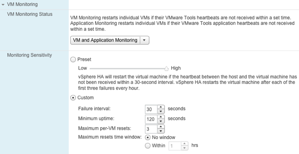
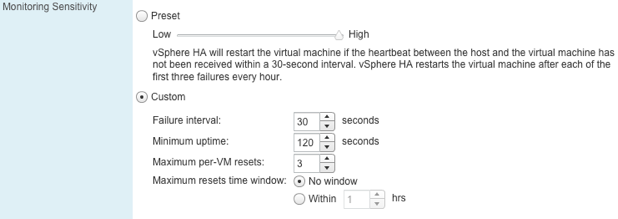

# VM and Application Monitoring
VM and Application Monitoring is an often overlooked but really powerful feature of HA. The reason for this is most likely that it is disabled by default and relatively new compared to HA. We have tried to gather all the information we could around VM and Application Monitoring, but it is a pretty straightforward product that actually does what you expect it would do.



## Why Do You Need VM/Application Monitoring? {#why-do-you-need-vm-application-monitoring}

VM and Application Monitoring acts on a different level from HA. VM/App Monitoring responds to a single virtual machine or application failure as opposed to HA which responds to a host failure. An example of a single virtual machine failure would, for instance, be the infamous “blue screen of death”. In the case of App Monitoring the type of failure that triggers a response is defined by the application developer or administrator.

### How Does VM/App Monitoring Work? {#how-does-vm-app-monitoring-work}

VM Monitoring resets individual virtual machines when needed. VM/App monitoring uses a heartbeat similar to HA. If heartbeats, and, in this case, VMware Tools heartbeats, are not received for a specific (and configurable) amount of time, the virtual machine will be restarted. These heartbeats are monitored by the HA agent and are not sent over a network, but stay local to the host.



When enabling VM/App Monitoring, the level of sensitivity (Figure 43) can be configured. The default setting should fit most situations. Low sensitivity basically means that the number of allowed “missed” heartbeats is higher and the chances of running into a false positive are lower. However, if a failure occurs and the sensitivity level is set to Low, the experienced downtime will be higher. When quick action is required in the event of a failure, “high sensitivity” can be selected. As expected, this is the opposite of “low sensitivity”. Note that the advanced settings mentioned in the following table are deprecated and listed for educational purposes.


| **Sensitivity** | **Failure interval** | **Max failures** | **Maxim resets time window** |
| --- | --- | --- | --- |
| **Low** | 120 Seconds | 3 | 7 Days |
| **Medium** | 60 Seconds | 3 | 24 Hours |
| **High** | 30 Seconds | 3 | 1 hour |

It is important to remember that VM Monitoring does not infinitely reboot virtual machines unless you specify a custom policy with this requirement. This is to avoid a problem from repeating. By default, when a virtual machine has been rebooted three times within an hour, no further attempts will be taken. Unless the specified time has elapsed. The following advanced settings can be set to change this default behavior or “custom” can be selected as shown in Figure 43.

Although the heartbeat produced by VMware Tools is reliable, VMware added a further verification mechanism. To avoid false positives, VM Monitoring also monitors I/O activity of the virtual machine. When heartbeats are not received AND no disk or network activity has occurred over the last 120 seconds, per default, the virtual machine will be reset. Changing the advanced setting “_das.iostatsInterval_” can modify this 120-second interval.

It is recommended to align the _das.iostatsInterval_ with the _failure interval_ selected in the VM Monitoring section of vSphere HA within the Web Client or the vSphere Client.

>**Basic design principle**: Align _das.iostatsInterval_ with the failure interval.

## Screenshots {#screenshots}

One of the most useful features as part of VM Monitoring is the fact that it takes screenshots of the virtual machine’s console. The screenshots are taken right before VM Monitoring resets a virtual machine. It is a very useful feature when a virtual machine “freezes” every once in a while for no apparent reason. This screenshot can be used to debug the virtual machine operating system when needed, and is stored in the virtual machine’s working directory as logged in the Events view on the Monitor tab of the virtual machine.

>**Basic design principle:** VM and Application monitoring can substantially increase availability. It is part of the HA stack and we strongly recommend using it!

## VM Monitoring Implementation Details {#vm-monitoring-implementation-details}

VM/App Monitoring is implemented as part of the HA agent itself. The agent uses the “Performance Manager” to monitor disk and network I/O; VM/App Monitoring uses the “usage” counters for both disk and network and it requests these counters once enough heartbeats have been missed that the configured policy is triggered.

As stated before, VM/App Monitoring uses heartbeats just like host-level HA. The heartbeats are monitored by the HA agent, which is responsible for the restarts. Of course, this information is also being rolled up into vCenter, but that is done via the Management Network, not using the virtual machine network. This is crucial to know as this means that when a virtual machine network error occurs, the virtual machine heartbeat will still be received. When an error occurs, HA will trigger a restart of the virtual machine when all three conditions are met:

1.  No VMware Tools heartbeat received
2.  No network I/O over the last 120 seconds
3.  No storage I/O over the last 120 seconds

Just like with host-level HA, the HA agent works independently of vCenter when it comes to virtual machine restarts.

### Timing {#timing}

The VM/App monitoring feature monitors the heartbeat(s) issued by a guest and resets the virtual machine if there is a heartbeat failure that satisfies the configured policy for the virtual machine. HA can monitor just the heartbeats issued by the VMware tools process or can monitor these heartbeats plus those issued by an optional in-guest agent.

If the VM monitoring heartbeats stop at time T-0, the minimum time before HA will declare a heartbeat failure is in the range of 81 seconds to 119 seconds, whereas for heartbeats issued by an in-guest application agent, HA will declare a failure in the range of 61 seconds to 89 seconds. Once a heartbeat failure is declared for application heartbeats, HA will attempt to reset the virtual machine. However, for VMware tools heartbeats, HA will first check whether any IO has been issued by the virtual machine for the last 2 minutes (by default) and only if there has been no IO will it issue a reset. Due to how HOSTD publishes the I/O statistics, this check could delay the reset by approximately 20 seconds for virtual machines that were issuing I/O within approximately 1 minute of T-0.

Timing details: the range depends on when the heartbeats stop relative to the HOSTD thread that monitors them. For the lower bound of the VMware tools heartbeats, the heartbeats stop a second before the HOSTD thread runs, which means, at T+31, the FDM agent on the host will be notified of a tools yellow state, and then at T+61 of the red state, which HA reacts to. HA then monitors the heartbeat failure for a minimum of 30 seconds, leading to the min of T+91\. The 30 seconds monitoring period done by HA can be increased using the das.failureInterval policy setting. For the upper bound, the FDM is not notified until T+59s (T=0 the failure occurs, T+29 HOSTD notices it and starts the heartbeat failure timer, and at T+59 HOSTD reports a yellow state, and at T+89 reports a red state).

For the heartbeats issued by an in-guest agent, no yellow state is sent, so the there is no additional 30 seconds period.

## Application Monitoring {#application-monitoring}

Application Monitoring is a part of VM Monitoring. Application Monitoring is a feature that partners and / or customers can leverage to increase resiliency, as shown in the screenshot below but from an application point of view rather than from a VM point of view. There is an SDK available to the general public and it is part of the guest SDK.


The Guest SDK is currently primarily used by application developers from partners like Symantec to develop solutions that increase resilience on a different level than VM Monitoring and HA. In the case of Symantec, a simplified version of Veritas Cluster Server (VCS) is used to enable application availability monitoring, including responding to issues. Note that this is not a multi-node clustering solution like VCS itself, but a single node solution.

Symantec ApplicationHA, as it is called, is triggered to get the application up and running again by restarting it. Symantec's ApplicationHA is aware of dependencies and knows in which order services should be started or stopped. If, however, this fails for a certain number (configurable option within ApplicationHA) of times, VMware HA will be requested to take action. This action will be a restart of the virtual machine.

Although Application Monitoring is relatively new and there are only a few partners currently exploring the capabilities, in our opinion, it does add a whole new level of resiliency. Your in-house development team could leverage functionality offered through the API, or you could use a solution developed by one of VMware’s partners. We have tested ApplicationHA by Symantec and personally feel it is the missing link. It enables you as System Admin to integrate your virtualization layer with your application layer. It ensures you as a System Admin that services which are protected are restarted in the correct order and it avoids the common pitfalls associated with restarts and maintenance. Note that VMware also introduced an "Application Monitoring" solution which was based on Hyperic technology, this product however has been deprecated and as such will not be discussed in this publication.

### Application Awareness API {#application-awareness-api}

The Application Awareness API is open for everyone. We feel that this is not the place to do a full deepdive on how to use it, but we do want to discuss it briefly.

The Application Awareness API allows for anyone to talk to it, including scripts, which makes the possibilities endless. Currently there are 6 functions defined:

*   ```_VMGuestAppMonitor_Enable_()```
    *   Enables Monitoring
*   ```_VMGuestAppMonitor_MarkActive_()```
    *   Call every 30 seconds to mark application as active
*   ```_VMGuestAppMonitor_Disable_()```
    *   Disable Monitoring
*   ```_VMGuestAppMonitor_IsEnabled_()```
    *   Returns status of Monitoring
*   ```_VMGuestAppMonitor_GetAppStatus_()```
    *   Returns the current application status recorded for the application
*   ```_VMGuestAppMonitor_Free(_)```
    *   Frees the result of the VMGuestAppMonitor_GetAppStatus() call

These functions can be used by your development team, however App Monitoring also offers a new executable. This allows you to use the functionality App Monitoring offers without the need to compile a full binary. This new command, vmware-appmonitoring.exe, takes the following arguments, which are not coincidentally similar to the functions:

*   Enable
*   Disable
*   markActive
*   isEnabled
*   getAppStatus

When running the command vmware-appmonitor.exe, which can be found under "VMware-GuestAppMonitorSDK\bin\win32\" the following output is presented:

```Usage: vmware-appmonitor.exe {enable | disable | markActive | isEnabled | getApp Status}```

As shown there are multiple ways of leveraging Application Monitoring and to enhance resiliency on an application level.

