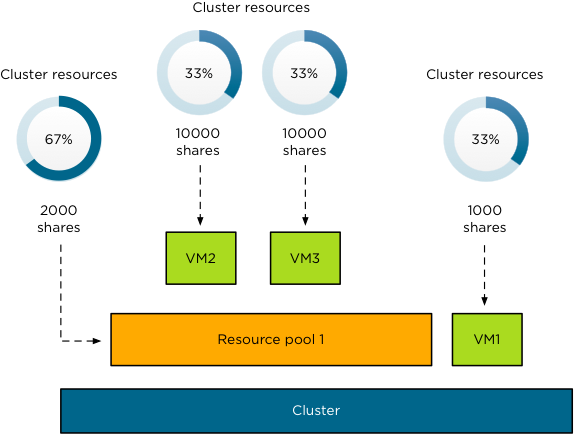
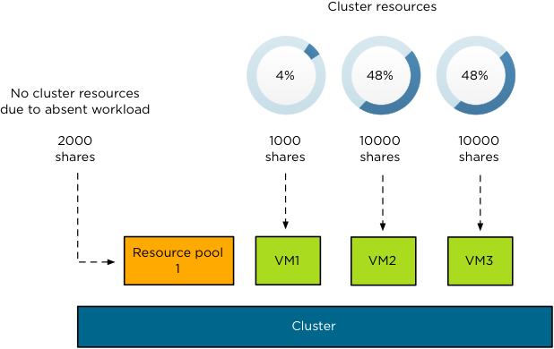
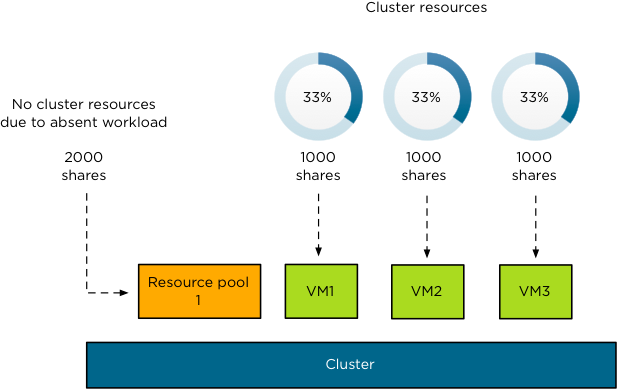

# vSphere HA and ...

Now that you know how HA works inside out, we want to explain the different integration points between HA, DRS and SDRS.

## HA and Storage DRS

vSphere HA informs Storage DRS when a failure has occurred. This to prevent the relocation of any HA protected virtual machine, meaning, a virtual machine that was powered on, but which failed, and has not been restarted yet due to their being insufficient capacity available. Further, Storage DRS is not allowed to Storage vMotion a virtual machine that is owned by a master other than the one vCenter Server is talking to. This is because in such a situation, HA would not be able to reprotect the virtual machine until the master to which vCenter Server is talking is able to lock the datastore again.

## Storage vMotion and HA

If a virtual machine needs to be restarted by HA and the virtual machine is in the process of being Storage vMotioned and the virtual machine fails, the restart process is not started until vCenter informs the master that the Storage vMotion task has completed or has been rolled back. If the source host fails, however, virtual machine will restart the virtual machine as part of the normal workflow. During a Storage vMotion, the HA agent on the host on which the Storage vMotion was initiated masks the failure state of the virtual machine. If, for whatever reason, vCenter is unavailable, the masking will timeout after 15 minutes to ensure that the virtual machine will be restarted.

Also note that when a Storage vMotion completes, vCenter will report the virtual machine as unprotected until the master reports it protected again under the new path.

## HA and DRS

HA integrates on multiple levels with DRS. It is a huge improvement and it is something that we wanted to stress as it has changed both the behavior and the reliability of HA.

### HA and Resource Fragmentation

When a failover is initiated, HA will first check whether there are resources available on the destination hosts for the failover. If, for instance, a particular virtual machine has a very large reservation and the Admission Control Policy is based on a percentage, for example, it could happen that resources are fragmented across multiple hosts. (For more details on this scenario, see Chapter 7.) HA will ask DRS to defragment the resources to accommodate for this virtual machine’s resource requirements. Although HA will request a defragmentation of resources, a guarantee cannot be given. As such, even with this additional integration, you should still be cautious when it comes to resource fragmentation.

### Flattened Shares

When shares have been set custom on a virtual machine an issue can arise when that VM needs to be restarted. When HA fails over a virtual machine, it will power-on the virtual machine in the Root Resource Pool. However, the virtual machine’s shares were those configured by a user for it, and not scaled for it being parented under the Root Resource Pool. This could cause the virtual machine to receive either too many or too few resources relative to its entitlement.

A scenario where and when this can occur would be the following:

VM1 has a 1000 shares and Resource Pool A has 2000 shares. However Resource Pool A has 2 virtual machines and both virtual machines will have 50% of those “2000” shares. The following diagram depicts this scenario:

When the host fails, both VM2 and VM3 will end up on the same level as VM1, the Root Resource Pool. However, as a custom shares value of 10,000 was specified on both VM2 and VM3, they will completely blow away VM1 in times of contention. This is depicted in the following diagram:

This situation would persist until the next invocation of DRS would re-parent the virtual machines VM2 and VM3 to their original Resource Pool. To address this issue HA calculates a flattened share value before the virtual machine’s is failed-over. This flattening process ensures that the virtual machine will get the resources it would have received if it had failed over to the correct Resource Pool. This scenario is depicted in the following diagram. Note that both VM2 and VM3 are placed under the Root Resource Pool with a shares value of 1000.

Of course, when DRS is invoked, both VM2 and VM3 will be re-parented under Resource Pool 1 and will again receive the number of shares they had been originally assigned.

### DPM and HA

If DPM is enabled and resources are scarce during an HA failover, HA will use DRS to try to adjust the cluster (for example, by bringing hosts out of standby mode or migrating virtual machines to defragment the cluster resources) so that HA can perform the failovers.

If HA strict Admission Control is enabled (default), DPM will maintain the necessary level of powered-on capacity to meet the configured HA failover capacity. HA places a constraint to prevent DPM from powering down too many ESXi hosts if it would violate the Admission Control Policy.

When HA admission control is disabled, HA will prevent DPM from powering off all but one host in the cluster. A minimum of two hosts are kept up regardless of the resource consumption. The reason this behavior has changed is that it is impossible to restart virtual machines when the only host left in the cluster has just failed.

In a failure scenario, if HA cannot restart some virtual machines, it asks DRS/DPM to try to defragment resources or bring hosts out of standby to allow HA another opportunity to restart the virtual machines. Another change is that DRS/DPM will power-on or keep on hosts needed to address cluster constraints, even if those host are lightly utilized. Once again, in order for this to be successful DRS will need to be enabled and configured to fully automated. When not configured to fully automated user action is required to execute DRS recommendations and allow the restart of virtual machines to occur.
